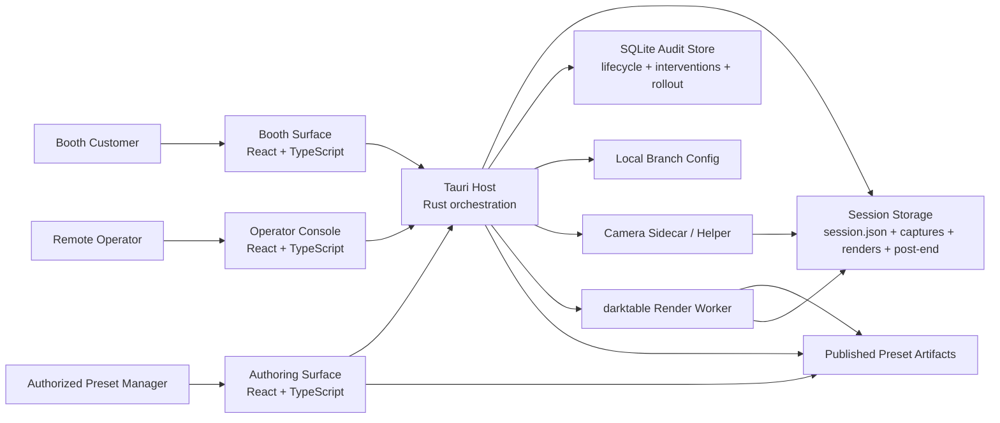
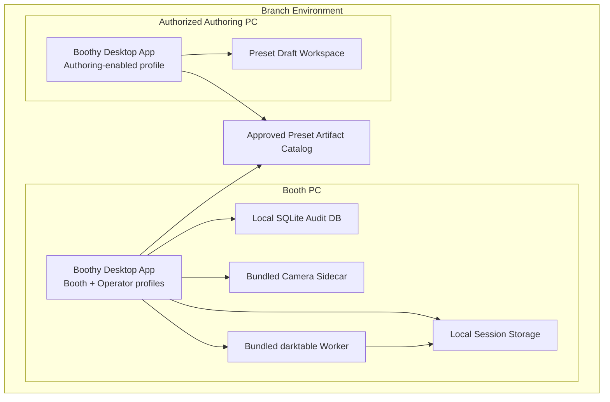

---
stepsCompleted:
  - 1
  - 2
  - 3
  - 4
  - 5
  - 6
  - 7
  - 8
inputDocuments:
  - '_bmad-output/planning-artifacts/prd.md'
  - '_bmad-output/planning-artifacts/ux-design-specification.md'
  - '_bmad-output/planning-artifacts/prd-validation-report-20260320-015539.md'
  - 'docs/release-baseline.md'
  - 'refactoring/2026-03-15-boothy-darktable-agent-foundation.md'
  - 'reference/darktable/README.md'
workflowType: 'architecture'
documentType: 'architecture-decision-document'
project_name: 'Boothy'
user_name: 'Noah Lee'
date: '2026-03-20'
lastStep: 8
status: 'complete'
completedAt: '2026-03-20'
---

# Architecture Decision Document

This document defines the implementation-shaping technical decisions for Boothy and records the system boundaries that downstream stories must preserve.

## Source Inputs

- [Product requirements document](./prd.md)
- [UX design specification](./ux-design-specification.md)
- [Darktable foundation pivot brief](../../refactoring/2026-03-15-boothy-darktable-agent-foundation.md)
- [Darktable reference](../../reference/darktable/README.md)

## System Overview

Boothy is a local-first Windows booth product with one packaged codebase and three capability-gated surfaces: customer booth flow, operator console, and authorized preset authoring. The Tauri/Rust host owns normalized session, timing, capture, render, and completion truth. The React frontend renders task-specific surfaces from that normalized state. Camera integration and darktable rendering remain isolated execution boundaries so booth UI never interprets raw helper or render-engine output directly.



## Project Context Analysis

### Requirements Overview

**Functional Requirements:**
Boothy currently defines 9 functional requirements. Architecturally, they cluster into seven capability groups. First, the booth must support a very low-friction session start based on a customer-facing booth alias composed of name plus phone-last-four and a bounded preset choice. Second, it must normalize readiness and capture eligibility so customers only see preparation, ready, waiting, or phone-required states rather than device internals. Third, it must persist captures into the active session and show latest-photo confidence while preserving strict current-session scope. Fourth, it must support bounded in-session cleanup behavior: current-session review, deletion, and forward-only preset changes for future captures. Fifth, it must run a timing and completion model that includes adjusted end time, warning and end alerts, and explicit post-end outcome states. Sixth, it must provide an internal preset-authoring and publication workflow for authorized users. Seventh, it must expose bounded operator diagnostics, recovery, and lifecycle visibility. Architecturally, this is a booth-first, preset-driven Windows product with three distinct user surfaces: booth customer, operator, and authorized preset management.

**Non-Functional Requirements:**
Six NFRs strongly shape the architecture. The customer surface must stay copy-light and free of technical or authoring language. Branches must remain consistent in preset catalog, timing rules, and booth journey except for tightly approved local settings. The booth must acknowledge customer actions quickly and show latest-photo feedback within a defined budget on approved hardware. Session isolation is strict: cross-session asset leakage is unacceptable. Timing rules and post-end transitions must be reliable enough to preserve customer trust. Release behavior must support staged rollout, rollback, and zero forced updates during active sessions. In addition, the loaded UX specification still contributes useful non-functional constraints around touch-friendly capture layouts, separate operator density, WCAG 2.2 AA accessibility targets, and deployment-oriented responsive behavior where those constraints do not conflict with the approved PRD and architecture baseline.

**Scale & Complexity:**
The customer journey is simpler than the previously assumed capture-to-editor product, but the architectural complexity remains high because the system must coordinate local session truth, real camera state, preset lifecycle, timing policy, operator recovery, and branch-safe deployment in one booth runtime. This is not cloud-scale complexity; it is boundary and workflow complexity centered on a local Windows desktop product.

- Primary domain: Windows desktop booth photo product with hardware integration, local session storage, and internal preset-authoring support
- Complexity level: high
- Estimated architectural components: 8

### Technical Constraints & Dependencies

- The primary runtime is an approved Windows desktop booth PC and monitor.
- The customer workflow must stay booth-first, local-first, and usable without browser navigation or manual OS file browsing.
- The authoritative product definition is the approved current PRD and aligned planning artifacts, not the older capture-to-full-editor assumption.
- The product adopts name-plus-last-four booth alias entry for the customer-facing start flow, but that alias must remain separate from the durable internal session identifier and any broader legacy operational assumptions.
- Real camera readiness, trigger, capture persistence, and latest-photo confirmation are product-critical dependencies.
- The customer sees only 1-6 approved published presets; detailed darktable-backed preset-authoring controls are restricted to authorized internal use.
- Timing policy is a core product dependency: adjusted end time, 5-minute warning, exact-end alert, export-waiting/completed/phone-required states, and operator extensions all affect flow truth.
- Branch variance must stay tightly controlled; active branches should differ only through approved local settings such as contact information or bounded operational toggles.
- Staged rollout, rollback, and zero forced updates during active sessions are hard desktop-operational constraints.
- Remote operator intervention remains part of the operating model when bounded recovery cannot restore a safe booth state.

### Cross-Cutting Concerns Identified

- Session identity, naming, and downstream handoff consistency
- Session-scoped asset persistence, deletion, and privacy isolation
- Camera-state normalization into customer-safe and operator-diagnostic views
- Preset lifecycle from internal authoring to approval, publication, activation, and forward-only in-session changes
- Timing-policy calculation, warning/alert behavior, and post-end state transitions
- Completion, export-waiting, and handoff guidance without reintroducing customer-side detailed editing
- Operational logging, exception classification, and bounded recovery
- Branch consistency, rollout safety, and rollback compatibility

## Starter Template Evaluation

### Primary Technology Domain

Desktop application with a React SPA frontend and a native Tauri/Rust host boundary.

This fits the current product definition directly. Boothy is a Windows booth application that must keep the customer flow, operator recovery flow, and internal preset-authoring capability inside one packaged local-first product. It needs explicit control over camera boundary handling, session-scoped filesystem truth, timed booth states, and bounded internal capability exposure.

### Starter Options Considered

1. **Official `create-tauri-app` with `React + TypeScript`**
   - Officially maintained Tauri entry path.
   - Gives a valid Tauri + React + TypeScript baseline quickly.
   - Good option if we optimize for fast official scaffolding over structural control.

2. **Official `Vite react-ts` + manual `Tauri CLI` initialization**
   - Also an official Tauri-supported path.
   - Best fit for Boothy because it keeps the frontend scaffold minimal while preserving a clear Tauri host boundary.
   - Makes it easier to impose the project’s domain-first structure, contract-first adapters, session-truth rules, and darktable-backed authoring integration without first undoing starter opinions.

3. **Electron Forge with `vite-typescript`**
   - Viable and maintained as an Electron path.
   - Weaker fit because the current project context and research are already centered on Tauri capabilities, sidecar packaging, and Rust host boundaries.
   - Electron Forge’s Vite path is still marked experimental, and pnpm requires additional linker configuration.

4. **Next.js static export + Tauri**
   - Technically possible if reduced to static export.
   - Poorer fit because Tauri’s frontend guidance favors SPA/Vite setups for most projects, and server-based SSR is not the intended model.
   - Adds framework weight without helping the booth-state, camera-boundary, or session-folder architecture.

### Selected Starter: Official `Vite react-ts` + manual `Tauri CLI` initialization

**Rationale for Selection:**
This is the best fit for the redesigned Boothy architecture. It stays on an official Tauri path, matches Tauri’s current SPA guidance, and gives the smallest scaffold around the real product boundaries. Boothy needs one packaged runtime with a clear host boundary, explicit sidecar/camera integration, and strict session/data rules. A minimal Vite frontend plus manual Tauri initialization gives us that without inheriting unnecessary starter structure. It also leaves room to keep internal preset-authoring capability in the same package while preventing the customer booth surface from turning back into a full editor product.

**Initialization Command:**

```bash
mkdir boothy
cd boothy
pnpm create vite . --template react-ts --no-interactive
pnpm add -D @tauri-apps/cli@latest
pnpm tauri init
```

Recommended Tauri init values:

```bash
App name: Boothy
Window title: Boothy
Web assets location: ../dist
Dev server URL: http://localhost:5173
Frontend dev command: pnpm run dev
Frontend build command: pnpm run build
```

**Architectural Decisions Provided by Starter:**

**Language & Runtime:**
React + TypeScript frontend with a Rust-based Tauri host boundary.

**Styling Solution:**
No heavy styling decision is forced by the starter. This is useful because Boothy still needs product-specific customer, operator, and internal-authoring surfaces rather than a generic starter design system.

**Build Tooling:**
Vite handles the frontend development/build loop, and Tauri connects the packaged desktop runtime to that frontend through `devUrl` and built static assets.

**Testing Framework:**
No strong testing stack is imposed. That is acceptable here because Boothy needs a custom test strategy centered on contracts, session manifests, host adapters, sidecar protocol behavior, and booth workflow seams.

**Code Organization:**
Minimal scaffold only. This supports the project’s domain-first architecture instead of pushing a starter-defined app structure that would need to be dismantled later.

**Development Experience:**
Fast frontend iteration, straightforward desktop packaging, explicit native boundary, and low starter baggage. This is especially useful for proving `capture shell -> normalized host state -> session-folder truth -> operator/internal surfaces` without structural noise.

**Note:** Project initialization is a bootstrap prerequisite that must be satisfied before corrected epic execution begins. It is not part of Epic 1 customer-value completion.

## Core Architectural Decisions

### Decision Priority Analysis

**Critical Decisions (Block Implementation):**
- Boothy remains one packaged Tauri application, but it is split into three capability-gated surfaces: `booth customer shell`, `operator console`, and `internal preset-authoring`.
- The durable source of truth for active booth work is a session-scoped filesystem root, not route state, UI memory, or SQLite.
- The customer-facing booth alias is distinct from the durable `sessionId`; the alias is used for booth guidance and approved handoff while the filesystem and contracts rely on the opaque session identifier.
- darktable-backed preset authoring and apply are the authoritative preset truth path; detailed module control stays only inside internal preset-authoring, not as a customer-facing editing workspace.
- The Rust host is the single normalization point for camera/helper truth, timing truth, and post-end workflow truth before those states are translated to UI.
- Camera integration is isolated behind a bundled helper/sidecar boundary with versioned messages and filesystem handoff; camera SDK truth does not leak into React.
- The first approved camera implementation profile is a Windows-only Canon EDSDK helper exe; generic multi-vendor abstraction is deferred until hardware evidence justifies it.
- Session timing rules, warning alerts, exact-end behavior, and post-end state transitions are host-owned workflow rules.
- Release behavior must preserve staged rollout, rollback, and zero forced update during active customer sessions.

**Important Decisions (Shape Architecture):**
- SQLite stores lifecycle, timing, intervention, publication, and rollout audit data, but it does not own photo or session artifact truth.
- Presets are stored as versioned approved bundles and published into a bounded booth catalog; active sessions reference preset versions explicitly.
- Tauri Store or equivalent local config keeps only minimal branch-local settings and runtime profile flags.
- One packaged app exposes booth flow by default and unlocks operator controls, and where enabled authoring controls, only after successful admin-password authentication plus capability checks.
- Boundary validation uses `Zod 4` in TypeScript and revalidation in Rust before file mutation, helper control, or preset publication.
- React Router `7.x` is limited to top-level surfaces such as `/booth`, `/operator`, `/authoring`, and `/settings`.
- The React frontend remains domain-first, and all host interaction stays behind typed adapter/service modules.

**Deferred Decisions (Post-MVP):**
- Centralized preset distribution service
- Stronger authoring authentication such as SSO or hardware-backed identity
- Remote log export and centralized observability
- Promotion from sidecar stdio to named pipes or a longer-lived local service if hardware evidence requires it

### Darktable Capability Scope

This section locks which darktable capabilities Boothy adopts as product truth, which capabilities Boothy only emulates in its own surfaces, and which capabilities remain explicitly out of scope. The goal is to prevent AI agents from drifting back toward a general-purpose editor or letting darktable internals leak into booth customer or operator workflows.

| Darktable capability or module | Decision | Rust host and booth-safe pipeline mapping | Surface and boundary mapping |
| --- | --- | --- | --- |
| XMP sidecar plus history stack | Adopt | The preset manifest stores `xmpTemplatePath`, `darktableVersion`, preview/final profiles, and render policies as the authoritative preset artifact. The Rust host validates that artifact, then records `raw`, `preview`, `final`, and render status separately in the session manifest. | Authoring exports approved XMP-backed presets. Customers never see history stacks or XMP. Operators see preset version, publish status, and render status only. |
| `darktable-cli` headless apply | Adopt | A dedicated Rust render worker invokes `darktable-cli` after raw ingest, isolates `configdir` and `library` per preview/final mode, runs jobs through a bounded queue, and translates failures into the typed host error envelope. Capture success and render success stay separate events. | Authoring publishes artifacts that the worker consumes. Customers see only preview/final readiness states. Operators see queue backlog, retry state, version pin health, and failure diagnostics. |
| Core look modules: `input color profile`, `exposure`, `filmic rgb`, `color balance rgb`, `diffuse or sharpen`, and denoise modules | Adopt | Module parameters stay opaque inside approved XMP artifacts; the Rust host does not reinterpret individual slider semantics. Preview and final profiles may diverge on detail/noise policy, but both remain pinned to the same approved preset version. | Authoring uses these modules to craft and review looks. Booth customers choose preset names/previews only. Operators manage publish/rollback, not per-session grading. |
| Geometry and optical correction: `lens correction`, `orientation`, `crop`, and `rotate and perspective` | Adopt with bounded use | These are allowed only when baked into an approved preset artifact or a host-owned normalization policy. The pipeline applies them deterministically during render and never exposes ad hoc per-session edits. | Authoring may use them to normalize lens/body output and framing. Customers never adjust geometry. Operators may inspect the active preset version but do not get live booth-floor geometry controls. |
| Styles and `.dtstyle` | Emulate for publication UX, exclude as runtime truth | Runtime apply never depends on style names or a shared darktable `data.db`. If a style is used during authoring convenience, it must be converted into an approved XMP-backed preset artifact before publication. | Authoring may offer style-like duplication/import/export workflows. Customers and booth operators select published Boothy presets, not raw darktable styles. |
| OpenCL/GPU capability and `--hq` quality modes | Adopt operationally | The Rust host probes capability during diagnostics, chooses preview/final execution profiles, and falls back safely when GPU support is unavailable. Preview favors latency; final export may use higher-quality settings and a heavier module path. | No GPU/OpenCL terminology reaches customers. Operators can see capability mismatches, fallback mode, and export performance diagnostics. |
| Darkroom UI, workspaces, and per-module panels | Emulate only inside internal authoring tools | The host cares about approved artifacts, not about reproducing the full darktable GUI contract. Boothy may wrap or launch constrained authoring flows, but the booth runtime never embeds a general editor. | Rich controls belong only to authorized preset authors. Customer and operator surfaces stay task-focused around selection, diagnostics, approval, and publication. |
| Library/lighttable asset management, collections, tagging, map/print/slideshow/book workflows | Exclude | Session filesystem roots and SQLite audit tables remain Boothy's system of record. If darktable uses its own library/config state during authoring or worker execution, that state is isolated support data and never business truth. | No customer or operator workflow relies on a darktable photo-library model. `PresetLibraryScreen` means a Boothy preset catalog, not a darktable-style asset browser. |
| Tethering, import, and camera/device control in darktable | Reference candidate only, not current runtime truth | darktable and its gphoto2-backed tethering path may be evaluated as a Canon 700D camera-boundary reference, but camera detection, readiness, capture, transfer, stale-process cleanup, and recovery remain owned by the stateful camera service and Rust host boundary in the approved baseline. Darktable execution begins only after raw transfer completes unless a later validated architecture revision promotes its camera path. | Customers and operators rely on host-normalized camera truth; darktable state never becomes the booth readiness signal without a dedicated camera-boundary validation and approval pass. |
| Watermark and export-adornment modules | Exclude from the MVP booth contract | The Rust host keeps handoff naming/packaging separate from look definition. If later approved, watermarking is an output policy layered onto final export only, not part of preview truth or customer choice. | Customers never control adornments. Operators would manage them, if ever enabled, as a bounded publication setting rather than an editing tool. |

### Data Architecture

- **Primary session truth:** Every active booth session owns one local session root that contains manifest metadata, captured originals, derived booth-facing images, handoff-ready outputs, and diagnostics snapshots.
- **Suggested session structure:** `session.json`, `captures/originals/`, `renders/previews/`, `renders/finals/`, `handoff/`, and optional `diagnostics/` under one session boundary.
- **Session identity split:** The booth-start flow captures a customer-facing `boothAlias` built from name plus phone-last-four, while the host creates an opaque durable `sessionId` for contracts, storage, and correlation.
- **Capture correlation:** Each capture is tracked by stable identifiers such as `sessionId`, `captureId`, `requestId`, active preset version, and file references.
- **Deletion model:** Approved customer deletion removes the current session’s correlated original and derived artifacts and records the deletion in manifest and audit data immediately.
- **Preset data model:** Presets are published as immutable versioned artifacts with manifest metadata, preview assets, a pinned darktable version, an approved XMP template path, and separate preview/final render profiles. Booth sessions only consume approved published artifacts.
- **Preset/session separation:** Preset-authoring never edits active booth session data directly. It produces future preset versions that later sessions may reference.
- **Operational store:** SQLite stores lifecycle events, timing transitions, operator interventions, preset publication audits, and rollout history.
- **Configuration store:** Minimal local config stores branch phone number, approved operational toggles, and runtime profile such as `booth` or `authoring-enabled`.
- **Validation strategy:** Shared boundary schemas are validated with `Zod 4` in TypeScript and revalidated in Rust.
- **Migration strategy:** `session.json` and preset bundles carry explicit schema versions; SQLite uses forward-only migrations; no migration may mutate active session artifacts in place.
- **Caching strategy:** In-memory caches may accelerate active screens, but no cache is allowed to outrank session folders or approved preset bundles.

### Authentication & Security

- **Booth customer authentication:** None. The booth customer flow is intentionally login-free.
- **Operator authentication:** Operator and authoring controls are unlocked with a locally managed admin password before any privileged surface or action becomes visible.
- **Authorization model:** Access is enforced through Tauri capabilities, runtime profile gating, window/surface separation, and host command boundaries.
- **Surface restriction rule:** Booth customers cannot access diagnostics, recovery controls, helper process management, or preset-authoring capabilities.
- **Authoring restriction rule:** Internal preset-authoring is enabled only for approved authoring profiles or installations and still requires successful admin authentication; it must not appear as part of the normal booth runtime path.
- **Data minimization:** Persist only the minimum session-identifying data approved by the PRD and operating model.
- **PII protection:** Logs, diagnostics, and handoff surfaces must not expose cross-session references or unnecessary customer identifiers.
- **Host authority:** Only the Rust host may spawn or control the helper, mutate session files, publish preset bundles, or apply rollout-sensitive actions.
- **Credential handling:** The admin password or its verification material must live outside customer-facing branch config in an OS-appropriate secure secret store or equivalent protected host-managed location.
- **Security posture:** MVP security is based on local least privilege, admin-password-gated privileged surfaces, bounded local profiles, and strict session separation rather than network-style account auth for the customer path.

### API & Communication Patterns

- **Frontend to host:** Tauri commands are the request-response path for session start, preset selection, capture, delete, timing updates, completion transitions, diagnostics queries, operator actions, and preset publication.
- **Host to frontend streaming:** Tauri channels carry ordered state changes for readiness, capture progress, latest-photo availability, timing transitions, completion state, and operator diagnostics.
- **Host to helper:** The camera/helper boundary uses bundled sidecar stdio with versioned JSON-line messages.
- **Helper contract shape:** The first contract should cover session configuration, capture request, health/status, restart/recovery, and correlation of file arrival back to the host.
- **Selected helper profile:** The approved first helper is `canon-helper.exe`, a Windows-targeted Canon EDSDK sidecar that owns USB camera session, capture trigger, download, and reconnect detection while the Rust host owns freshness and UI-safe projection.
- **Boot semantics:** `helper-ready` means protocol conversation can begin; it does not mean camera `ready`, and booth `Ready` still waits on fresh `camera-status`.
- **Image transfer rule:** Raw image bytes and derived booth files move by filesystem handoff, not by large JSON IPC payloads.
- **Preset/render core rule:** The Rust render worker executes approved darktable-backed preset artifacts through `darktable-cli`; booth routes receive only booth-safe outputs and typed status, never module-level editing APIs.
- **Error handling standard:** All host-facing failures use one typed envelope with machine-readable code, severity, retryability, customer-safe state, and operator-facing next action.
- **State normalization:** Camera/helper truth, timing truth, and completion truth are normalized in the host once, then translated into booth copy or operator diagnostics separately.

### Frontend Architecture

- **Top-level app model:** One React application with top-level surfaces such as `/booth`, `/operator`, `/authoring`, and `/settings`.
- **Routing strategy:** React Router `7.x` is used only for surface entry and separation. Workflow truth remains state-driven.
- **State management:** Use explicit reducers and React Context by domain: `session-domain`, `preset-catalog`, `capture-adapter`, `timing-policy`, `completion-handoff`, `operator-console`, and `preset-authoring`.
- **Component architecture:** Keep a domain-first structure so booth customer flow, operator flow, and authoring flow do not blur together.
- **Booth shell rule:** The customer UI stays low-choice, touch-friendly, and confidence-oriented. It never expands into a general editor workspace.
- **Privilege-gating rule:** Operator navigation and any authoring or settings controls remain hidden until admin authentication succeeds and the current machine profile permits those surfaces.
- **Authoring rule:** Internal preset-authoring may wrap or launch darktable-based editing/review flows and Boothy publication controls, but only inside the authoring surface.
- **Performance strategy:** Keep the booth shell light, preload bounded preset previews, lazy-load operator and authoring surfaces, and use React `19.x` async patterns for non-blocking transitions.
- **Boundary rule:** React components do not call Tauri directly. Typed adapters and services own all `invoke`, channel subscriptions, and host orchestration.

### Infrastructure & Deployment

- **Runtime hosting:** Approved Windows booth PCs run the same packaged app with the booth surface visible by default; admin authentication can unlock operator controls, and approved internal machines may additionally enable the authoring surface.
- **Package strategy:** One package family and one codebase ship every deployment, while capability/profile differences and admin authentication together determine which privileged surfaces are enabled on a given machine and for a given session.
- **Build and release:** GitHub Actions plus `tauri-action` handle build, packaging, and signing-ready Windows release flow.
- **Release safety:** Branch rollout is staged, rollback-capable, and must preserve last-approved installers plus active-session compatibility.
- **Update policy:** No forced update may interrupt an active booth session.
- **Environment configuration:** Branch-local configuration stays minimal, explicit, and auditable.
- **Monitoring and logging:** Structured local logs plus SQLite audit tables provide the MVP observability base.
- **Scaling strategy:** The system scales by booth instance, preset publication discipline, and rollout control rather than centralized backend throughput.

## Deployment Architecture

Boothy deploys as a packaged Windows desktop application. The booth runtime, operator console, and optional authoring surface share one codebase and package, but capability flags determine which privileged surfaces are available on a given machine and admin authentication determines when those surfaces become visible. Customer-session truth stays local on the booth PC. Operator and authoring workflows consume the same host contracts rather than bypassing them.



### Deployment Responsibilities

- Booth PCs host the active customer session, current-session storage, lifecycle audit data, camera sidecar, and render worker.
- Authoring-enabled machines create and publish new preset artifacts without mutating booth sessions already in progress.
- The preset artifact catalog is the only approved bridge between internal authoring and future booth sessions.
- Rollout and rollback act on approved app builds plus approved preset stacks, and they must preserve active-session compatibility.

### Decision Impact Analysis

**Implementation Sequence:**
1. Freeze the shared contracts: session manifest, preset bundle schema, error envelope, helper protocol, and runtime profile/capability model.
2. Define the session folder structure and preset publication structure.
3. Build the Rust host state model for readiness, capture, timing, completion, and diagnostics.
4. Implement the booth shell against mocked host and mocked helper behavior.
5. Implement operator diagnostics and bounded recovery against the same normalized host truth.
6. Implement internal preset-authoring and publication on top of the darktable-backed preset artifact workflow without exposing module-level controls to booth routes.
7. Integrate the real camera/helper boundary and prove `capture request -> file arrival -> latest-photo confirmation -> handoff state`.
8. Add rollout, rollback, and signing-ready release guardrails.

**Cross-Component Dependencies:**
- Session manifest and capture correlation rules affect booth review, deletion, handoff, diagnostics, and privacy guarantees.
- Preset bundle format affects authoring, booth preset selection, preview rendering, and cross-branch consistency.
- Runtime profile and capability boundaries affect security, packaging, and which UI surfaces exist in each deployment.
- Error envelope and normalized state model affect booth guidance, operator recovery, and helper integration.
- Release safety depends on config discipline, schema compatibility, and preserving active-session behavior across versions.

## Implementation Patterns & Consistency Rules

### Pattern Categories Defined

**Critical Conflict Points Identified:**
9 areas where AI agents could make different choices and silently break compatibility across React, Tauri/Rust, sidecar, and session storage boundaries.

### Naming Patterns

**Database Naming Conventions:**
- SQLite tables use `snake_case` plural names such as `session_events`, `preset_publications`, `operator_interventions`.
- Columns use `snake_case` such as `session_id`, `occurred_at`, `preset_version`.
- Indexes use `idx_<table>_<columns>` such as `idx_session_events_session_id_occurred_at`.

**API Naming Conventions:**
- Rust Tauri command identifiers use `snake_case` such as `start_session`, `select_preset`, `request_capture`.
- TypeScript never hardcodes raw command strings outside the host adapter layer; exported wrapper functions use `camelCase`.
- Channel and event names use `dot.case` namespaces such as `session.stateChanged`, `capture.progress`, `timing.warning`, `postend.outcomeChanged`.
- Route paths use `kebab-case` and are reserved for top-level surfaces only, such as `/booth`, `/operator`, `/authoring`, `/settings`.

**Code Naming Conventions:**
- React component names and component filenames use `PascalCase`, such as `BoothShell.tsx`, `OperatorConsole.tsx`, `PresetAuthoringShell.tsx`.
- Hooks use `camelCase` with `use` prefix, such as `useSessionState.ts`, `usePresetCatalog.ts`.
- TypeScript services/adapters use `camelCase` filenames, such as `hostCommands.ts`, `presetPublishService.ts`.
- Rust modules use `snake_case.rs`, such as `session_manifest.rs`, `timing_policy.rs`.
- Domain directories use `kebab-case`, such as `booth-shell`, `operator-console`, `preset-authoring`.

### Structure Patterns

**Project Organization:**
- Frontend code is organized by domain first, not by technical type first.
- `shared-ui` holds presentation-only primitives; domain rules and translation logic stay in the owning domain.
- Tauri command handlers live under `src-tauri/src/commands/`, while domain logic lives in dedicated Rust modules outside the command entrypoint layer.
- Cross-language contract definitions must have one authoritative source per contract family and must not be duplicated casually across frontend, host, and helper.

**File Structure Patterns:**
- Co-locate unit tests close to domain logic where possible.
- Keep cross-boundary contract tests under `tests/contract/`.
- Keep e2e coverage under `tests/e2e/`.
- Keep SQLite migrations under `src-tauri/migrations/`.
- Keep helper protocol examples and fixtures under `sidecar/protocol/`.

### Format Patterns

**API Response Formats:**
- Host command responses use typed DTOs or typed error envelopes, not unstructured `any` or ad hoc object returns.
- Error envelopes follow one standard shape with fields such as `code`, `severity`, `retryable`, `customerState`, `operatorAction`, and `details` only where explicitly allowed.
- Success responses return direct typed payloads unless a command needs a standardized wrapper for versioning or state metadata.

**Data Exchange Formats:**
- TypeScript-facing JSON fields use `camelCase`.
- Rust internal storage and SQLite schemas use `snake_case`.
- Session manifest files use one explicitly versioned schema and must not drift per feature.
- Dates and timestamps use ISO 8601 / RFC3339 strings at boundaries.
- Booleans remain `true/false`; no numeric boolean encoding.
- Nullability must be explicit in schemas; absence and null are not interchangeable.

### Communication Patterns

**Event System Patterns:**
- Use Tauri `channels` for ordered workflow/status streams and reserve generic events for coarse notifications only.
- Event names use `dot.case` and remain domain-qualified.
- Event payloads always include `sessionId`, `type`, and `schemaVersion` where applicable.
- Version helper-facing protocol messages explicitly when they cross the sidecar boundary.

**State Management Patterns:**
- React state is reducer-driven and domain-scoped.
- Actions use `domain/actionVerb` style or equivalent typed constants, such as `session/startRequested`, `timing/warningTriggered`.
- Selectors own UI-facing translation logic; components do not reinterpret raw host state inline.
- Customer-facing and operator-facing state projections must derive from the same normalized host truth, not from separate ad hoc transforms.

### Process Patterns

**Error Handling Patterns:**
- Distinguish between customer-safe messaging, operator-facing diagnosis, and raw internal logs.
- Never surface raw helper, filesystem, or SDK diagnostics directly on customer screens.
- Retry logic must be explicit at the adapter or host orchestration layer, not hidden in UI components.
- Errors that affect session integrity must be logged as lifecycle or intervention records with correlation IDs.

**Loading State Patterns:**
- Use explicit loading states named by workflow meaning, not generic booleans alone: `preparing`, `ready`, `capturePending`, `exportWaiting`, `completed`, `phoneRequired`.
- Loading states that affect customer actionability must map to approved customer-facing copy.
- Long-running operations must emit progress or status updates through the normalized host communication path.
- Loading completion is determined by workflow truth, not by route entry or component mount alone.

### Enforcement Guidelines

**All AI Agents MUST:**
- Preserve the session folder as the durable source of truth.
- Keep React UI code out of direct Tauri invocation and helper orchestration.
- Reuse the standardized schema, error, and event naming rules exactly.
- Avoid introducing parallel contract definitions across language boundaries.
- Keep customer-visible state translation centralized and reviewable.

**Pattern Enforcement:**
- Contract-sensitive changes must be reviewed against shared schemas, manifest rules, and event naming rules.
- New domains or files should be placed according to the documented directory grammar before code is merged.
- Pattern violations should be corrected at the boundary layer first, not patched locally in UI components.

### Pattern Examples

**Good Examples:**
- `start_session` Rust command wrapped by `startSession()` in TypeScript
- `session.stateChanged` channel event carrying a typed payload with normalized session status
- `session.json` manifest with explicit `schemaVersion`
- `booth-shell/selectors/customerStatusCopy.ts` owning customer-safe text translation
- `tests/contract/errorEnvelope.test.ts` protecting boundary compatibility

**Anti-Patterns:**
- React components calling `invoke('request_capture')` directly
- Customer UI deciding camera readiness from raw helper error text
- Duplicate `SessionManifest` shapes defined separately in frontend, Rust, and helper code without one source of truth
- Using route changes as the authoritative signal that the product moved from capture to handoff
- Storing cross-session image indexes in a cache that can drift from filesystem truth

## Project Structure & Boundaries

### Complete Project Directory Structure

```text
boothy/
├── README.md
├── package.json
├── pnpm-lock.yaml
├── tsconfig.json
├── vite.config.ts
├── eslint.config.js
├── prettier.config.cjs
├── index.html
├── .env.example
├── .gitignore
├── .github/
│   └── workflows/
│       ├── ci.yml
│       └── release-windows.yml
├── docs/
│   ├── contracts/
│   │   ├── session-manifest.md
│   │   ├── preset-bundle.md
│   │   ├── error-envelope.md
│   │   └── sidecar-protocol.md
│   ├── architecture/
│   └── runbooks/
├── src/
│   ├── main.tsx
│   ├── app/
│   │   ├── App.tsx
│   │   ├── routes.tsx
│   │   ├── providers/
│   │   └── boot/
│   ├── shared-ui/
│   │   ├── components/
│   │   ├── layout/
│   │   └── tokens/
│   ├── shared-contracts/
│   │   ├── dto/
│   │   ├── schemas/
│   │   ├── events/
│   │   └── errors/
│   ├── booth-shell/
│   │   ├── screens/
│   │   │   ├── SessionStartScreen.tsx
│   │   │   ├── PresetSelectScreen.tsx
│   │   │   ├── ReadinessScreen.tsx
│   │   │   ├── CaptureScreen.tsx
│   │   │   ├── ReviewScreen.tsx
│   │   │   ├── TimingWarningScreen.tsx
│   │   │   └── HandoffScreen.tsx
│   │   ├── components/
│   │   ├── selectors/
│   │   ├── copy/
│   │   └── tests/
│   ├── operator-console/
│   │   ├── screens/
│   │   │   ├── OperatorSummaryScreen.tsx
│   │   │   ├── RecoveryActionsScreen.tsx
│   │   │   ├── DiagnosticsScreen.tsx
│   │   │   └── SessionRepairScreen.tsx
│   │   ├── components/
│   │   ├── selectors/
│   │   └── tests/
│   ├── preset-authoring/
│   │   ├── screens/
│   │   │   ├── PresetLibraryScreen.tsx
│   │   │   ├── PresetEditorScreen.tsx
│   │   │   ├── PresetPreviewScreen.tsx
│   │   │   └── PublishWorkflowScreen.tsx
│   │   ├── components/
│   │   ├── state/
│   │   ├── services/
│   │   └── tests/
│   ├── session-domain/
│   │   ├── state/
│   │   ├── services/
│   │   ├── selectors/
│   │   └── tests/
│   ├── capture-adapter/
│   │   ├── host/
│   │   ├── state/
│   │   ├── services/
│   │   └── tests/
│   ├── timing-policy/
│   │   ├── state/
│   │   ├── services/
│   │   └── tests/
│   ├── completion-handoff/
│   │   ├── state/
│   │   ├── services/
│   │   └── tests/
│   ├── preset-catalog/
│   │   ├── state/
│   │   ├── services/
│   │   └── tests/
│   ├── branch-config/
│   │   ├── services/
│   │   ├── state/
│   │   └── tests/
│   └── diagnostics-log/
│       ├── services/
│       ├── selectors/
│       └── tests/
├── src-tauri/
│   ├── Cargo.toml
│   ├── build.rs
│   ├── tauri.conf.json
│   ├── capabilities/
│   │   ├── booth-window.json
│   │   ├── operator-window.json
│   │   └── authoring-window.json
│   ├── migrations/
│   │   ├── 0001_init.sql
│   │   ├── 0002_operator_interventions.sql
│   │   ├── 0003_preset_publications.sql
│   │   └── 0004_timing_transitions.sql
│   ├── tests/
│   │   ├── session_manifest.rs
│   │   ├── preset_bundle.rs
│   │   ├── error_envelope.rs
│   │   └── sqlite_logs.rs
│   └── src/
│       ├── main.rs
│       ├── app_state.rs
│       ├── commands/
│       │   ├── session_commands.rs
│       │   ├── capture_commands.rs
│       │   ├── preset_commands.rs
│       │   ├── timing_commands.rs
│       │   ├── handoff_commands.rs
│       │   ├── operator_commands.rs
│       │   └── branch_config_commands.rs
│       ├── contracts/
│       │   ├── dto.rs
│       │   ├── error_envelope.rs
│       │   ├── event_payloads.rs
│       │   └── schema_version.rs
│       ├── session/
│       │   ├── session_manifest.rs
│       │   ├── session_paths.rs
│       │   └── session_repository.rs
│       ├── capture/
│       │   ├── camera_host.rs
│       │   ├── ingest_pipeline.rs
│       │   ├── sidecar_client.rs
│       │   └── normalized_state.rs
│       ├── preset/
│       │   ├── preset_bundle.rs
│       │   ├── preset_catalog.rs
│       │   ├── authoring_pipeline.rs
│       │   └── preview_service.rs
│       ├── timing/
│       │   ├── timing_policy.rs
│       │   ├── alerts.rs
│       │   └── scheduler.rs
│       ├── handoff/
│       │   ├── completion_state.rs
│       │   ├── handoff_service.rs
│       │   └── output_repository.rs
│       ├── diagnostics/
│       │   ├── lifecycle_log.rs
│       │   ├── intervention_log.rs
│       │   └── fault_classifier.rs
│       ├── branch_config/
│       │   ├── config_store.rs
│       │   ├── rollout_guard.rs
│       │   └── updater_policy.rs
│       ├── db/
│       │   ├── sqlite.rs
│       │   ├── migrations.rs
│       │   └── repositories/
│       └── support/
│           ├── clock.rs
│           ├── fs.rs
│           └── tracing.rs
├── sidecar/
│   ├── README.md
│   ├── protocol/
│   │   ├── messages.schema.json
│   │   └── examples/
│   ├── fixtures/
│   └── canon-helper/
│       ├── src/
│       ├── tests/
│       └── build/
├── tests/
│   ├── contract/
│   │   ├── sessionManifest.test.ts
│   │   ├── presetBundle.test.ts
│   │   └── errorEnvelope.test.ts
│   ├── integration/
│   │   ├── captureToReview.test.ts
│   │   ├── timingTransitions.test.ts
│   │   └── handoffCompletion.test.ts
│   ├── e2e/
│   │   ├── booth-flow.spec.ts
│   │   ├── operator-recovery.spec.ts
│   │   └── authoring-flow.spec.ts
│   └── fixtures/
│       ├── sessions/
│       └── sidecar/
└── storage/
    ├── fixtures/
    └── sample-sessions/
```

### Architectural Boundaries

**API Boundaries:**
- React UI reaches native behavior only through typed adapters/services under `src/*/services` or `src/*/host`.
- Tauri commands in `src-tauri/src/commands/` are the only frontend-to-host entry points.
- Sidecar communication is isolated to `src-tauri/src/capture/sidecar_client.rs` and `sidecar/canon-helper/`.
- `sidecar/canon-helper/` is expected to remain a thin Canon EDSDK adapter boundary, not a second source of session, preset, timing, or UI truth.

**Component Boundaries:**
- `booth-shell` owns booth customer flow only.
- `operator-console` owns diagnostics and bounded recovery actions.
- `preset-authoring` owns internal preset creation and publication workflows.
- `session-domain` owns lifecycle truth and shared selectors.

**Service Boundaries:**
- `capture-adapter` owns host-facing capture orchestration.
- `preset-catalog` owns approved preset list consumption on booth surfaces.
- `timing-policy` owns timing calculations, warnings, and end-time transitions.
- `completion-handoff` owns post-end state transitions and guidance.
- `branch-config` owns branch-local config and rollout safety rules.
- `diagnostics-log` owns queryable operational history.

**Data Boundaries:**
- Session folders own image and session truth.
- SQLite owns logs, audits, timing transitions, and publication history.
- Tauri Store owns minimal branch-local config only.
- Sidecar owns live camera truth while running, but not durable product truth.

### Requirements to Structure Mapping

**Feature/FR Mapping:**
- FR-001/FR-002 (session start + preset selection)
  - `src/booth-shell/`
  - `src/preset-catalog/`
  - `src-tauri/src/commands/session_commands.rs`
  - `src-tauri/src/preset/`
- FR-003/FR-004 (readiness + latest-photo confidence)
  - `src/booth-shell/`
  - `src/capture-adapter/`
  - `src-tauri/src/capture/`
- FR-005 (current-session review/delete + future preset change)
  - `src/booth-shell/`
  - `src/session-domain/`
  - `src-tauri/src/session/`
- FR-006 (timing rules, warning, end)
  - `src/timing-policy/`
  - `src-tauri/src/timing/`
- FR-007 (export-waiting / completion / handoff)
  - `src/completion-handoff/`
  - `src-tauri/src/handoff/`
- FR-008 (authorized preset authoring, validation, approval, publication, and rollback)
  - `src/preset-authoring/`
  - `src-tauri/src/preset/`
  - `tests/contract/`
- FR-009 (operator diagnostics/recovery)
  - `src/operator-console/`
  - `src/diagnostics-log/`
  - `src-tauri/src/diagnostics/`

**Cross-Cutting Concerns:**
- Shared contracts
  - `src/shared-contracts/`
  - `src-tauri/src/contracts/`
  - `tests/contract/`
- Session lifecycle truth
  - `src/session-domain/`
  - `src-tauri/src/session/`
- Rollout/rollback safety
  - `src/branch-config/`
  - `src-tauri/src/branch_config/`
  - `.github/workflows/release-windows.yml`

### Integration Points

**Internal Communication:**
- UI domains call typed adapters/services.
- Adapters call Tauri commands/channels.
- Rust commands delegate into domain modules.
- Rust capture domain talks to helper through the sidecar protocol boundary.

**External Integrations:**
- Canon/camera helper integration lives under `sidecar/canon-helper/`.
- Future reservation/policy sync enters through `branch-config/` or a separate integration module, not through booth flow domains.
- Remote support tools remain external to the product runtime.

**Data Flow:**
- Session start creates session identity and session root.
- Capture writes originals into the session folder and updates session manifest.
- Preset selection binds a preset version to the session.
- Review and deletion operate only on current session assets.
- Timing policy emits warning/end alerts and shifts the workflow state.
- Post-end states transition to export-waiting, completed, or phone-required.
- Diagnostics and operator actions are recorded into SQLite.

### File Organization Patterns

**Configuration Files:**
- Root: frontend/tooling config
- `src-tauri/`: native packaging, capabilities, migrations
- `docs/contracts/`: durable contract documentation

**Source Organization:**
- Frontend is domain-first.
- Rust host is boundary-first and domain-backed.
- Sidecar is isolated as its own implementation boundary.

**Test Organization:**
- Unit tests close to domain code
- Contract tests at the top level
- E2E tests by product flow
- Rust host tests under `src-tauri/tests/`

**Asset Organization:**
- Session/sample assets under `storage/` and `tests/fixtures/`
- Protocol fixtures under `sidecar/protocol/examples/`

### Build and Local Development

**Local development loop:**
- `pnpm dev` for Vite frontend loop
- `pnpm tauri dev` for integrated desktop loop
- Helper fixtures or mock sidecar selected through environment/config

**Build pipeline:**
- Frontend build to `dist/`
- Tauri packaging from `src-tauri/`
- Sidecar bundled during desktop packaging

**Release packaging:**
- GitHub Actions builds signing-ready Windows installers
- Branch rollout and rollback artifacts remain compatible with the local config and session data model

## Closed Contract Freeze Baseline

The architecture is now ready to support regenerated implementation stories against the following frozen contract surfaces.

- Session manifest contract: exact `session.json` schema including capture correlation IDs, preset version references, raw/preview/final fields, render-status correlation, and post-end state fields.
- Preset bundle contract: immutable published preset artifact schema including approved compatibility metadata, preview/final render profiles, rollback-safe identifiers, and catalog-facing metadata required for future-session publication only.
- Sidecar protocol contract: concrete request/response and event examples for success, retryable failure, terminal failure, and stale-helper recovery, with booth `Ready` and operator `카메라 연결 상태` both derived from the same host-normalized camera/helper truth.
- Canon helper implementation profile: the chosen Windows-only Canon EDSDK helper packaging, ownership split, diagnostics expectations, and recovery semantics that refine the generic sidecar contract for the current product decision.
- Authoring publication contract: required publication payload fields, approval-state transitions, immutable published artifact requirements, audit metadata, and future-session-only application rules.
- Release runbooks, fixture naming conventions, and sample datasets may continue to expand, but they no longer block regeneration of the corrected implementation-story baseline for preset publication, operator recovery, and release-governance tracks.

## Initial Implementation Priorities

1. Regenerate the implementation story artifacts for Epic 4-6 against the frozen contract baseline and the approved corrected epic map.
2. Implement the authorized-user publication flow and the truthful preview/final-render outcome flow around the frozen publication, manifest, render-status, and sidecar contracts.
3. Wire the booth, operator, and authoring surfaces through typed adapters so UI never bypasses host normalization.
4. Implement timing/completion and release-governance work as separate downstream epic tracks with their own verification gates.

## Architecture Validation Results

### Coherence Validation

**Decision Compatibility:**
The selected architecture is internally coherent. The Tauri + React + Rust host boundary aligns with the booth-first Windows runtime requirements, and the darktable-backed preset pipeline fits the preset artifact model without conflicting with the stateful camera boundary. Session filesystem truth, SQLite audit scope, and sidecar responsibility are clearly separated.

**Pattern Consistency:**
Implementation patterns support the architecture well. Naming rules, event rules, DTO and error-envelope rules, and host-boundary rules are consistent with the chosen technology stack and reduce the main areas where AI agents could diverge.

**Structure Alignment:**
The project structure supports the architectural decisions directly. Domain-first frontend organization, boundary-first Rust host organization, and the isolated sidecar folder all reinforce the intended runtime boundaries and implementation flow.

### Requirements Coverage Validation

**Functional Requirements Coverage:**
All functional requirements from FR-001 through FR-009 are architecturally supported through explicit module ownership, boundary rules, or structure mapping.

**Non-Functional Requirements Coverage:**
All non-functional requirements from NFR-001 through NFR-006 are supported at the architectural level through copy-safe UI boundaries, session isolation, timing policy ownership, rollout and rollback controls, and booth-runtime-safe performance and deployment constraints.

### Implementation Readiness Validation

**Decision Completeness:**
Critical architectural decisions are documented clearly enough to guide implementation. The main runtime, data, boundary, preset, timing, and rollout decisions are all present.

**Structure Completeness:**
The directory structure is specific and implementation-oriented rather than generic. Major modules, test locations, contracts, sidecar boundaries, and release-related files are all identified.

**Pattern Completeness:**
The document defines enough consistency rules for multiple AI agents to implement compatible code without inventing conflicting naming, communication, or state-management approaches.

### Gap Analysis Results

**Critical Gaps:**
- None identified.

**Important Gaps:**
- None identified. Source-input hygiene has been reconciled against the approved current artifact set.

**Nice-to-Have Gaps:**
- Future implementation artifacts may benefit from separate contract example files for `session.json`, preset bundles, and sidecar protocol messages if they are not created alongside the first stories.

### Validation Issues Addressed

- No blocking compatibility issues were found.
- The architecture is suitable for downstream implementation planning and story regeneration.
- Minor source-reference cleanup remains optional but recommended.

### Architecture Completeness Checklist

**Requirements Analysis**
- [x] Project context thoroughly analyzed
- [x] Scale and complexity assessed
- [x] Technical constraints identified
- [x] Cross-cutting concerns mapped

**Architectural Decisions**
- [x] Critical decisions documented
- [x] Technology stack fully specified
- [x] Integration patterns defined
- [x] Performance and rollout constraints addressed

**Implementation Patterns**
- [x] Naming conventions established
- [x] Structure patterns defined
- [x] Communication patterns specified
- [x] Process patterns documented

**Project Structure**
- [x] Complete directory structure defined
- [x] Component boundaries established
- [x] Integration points mapped
- [x] Requirements-to-structure mapping completed

### Architecture Readiness Assessment

**Overall Status:** READY FOR IMPLEMENTATION

**Confidence Level:** High

**Key Strengths:**
- Clear runtime and data-boundary separation
- Strong protection against AI-agent implementation drift
- Direct traceability from PRD requirements to modules and contracts
- Good operational alignment for booth-safe rollout and recovery

**Areas for Future Enhancement:**
- Keep source-input wording aligned with the approved artifact set if future revisions change the input baseline
- Add concrete contract example artifacts during early implementation
- Revalidate sidecar transport choices later if hardware evidence changes

### Implementation Handoff

**AI Agent Guidelines:**
- Follow the documented boundaries exactly.
- Treat the session folder as the durable source of truth.
- Keep React out of direct host and helper orchestration.
- Reuse the documented event, DTO, and error-envelope rules consistently.

**First Implementation Priority:**
Regenerate implementation stories and contract artifacts against this frozen architecture baseline, then begin with the session, preset, and sidecar contract surface.
