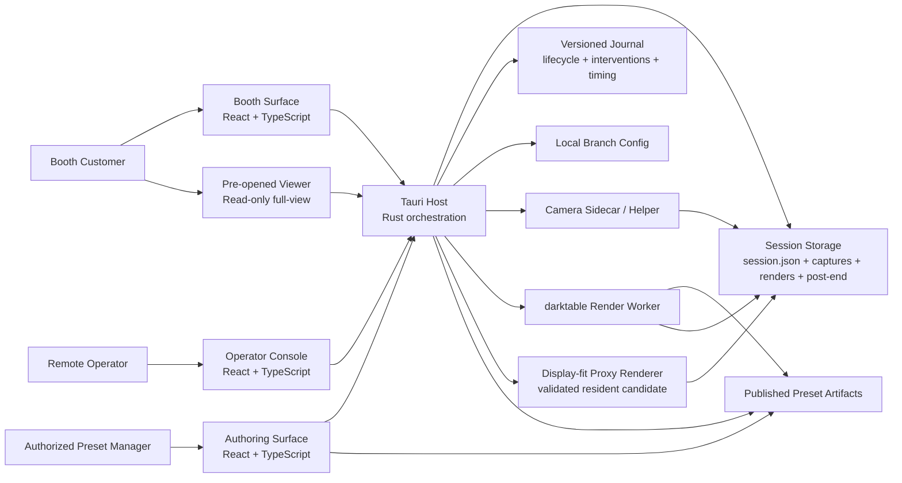
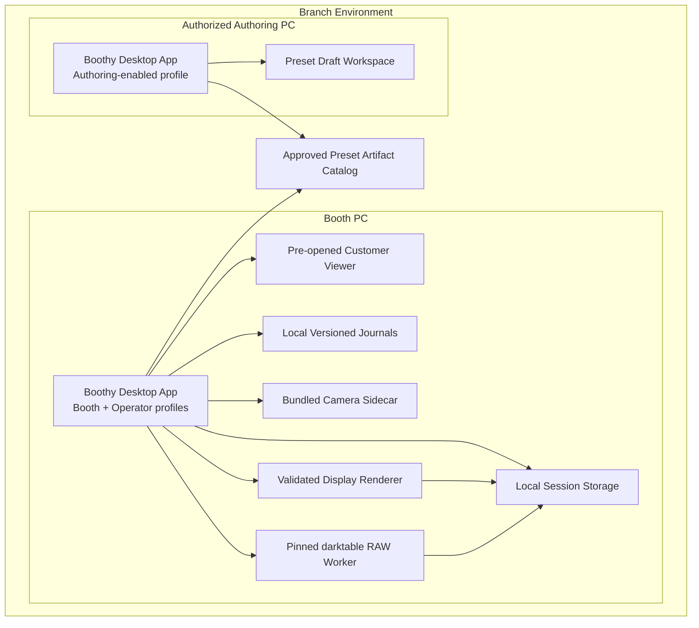

---
stepsCompleted:
  - 1
  - 2
  - 3
  - 4
  - 5
  - 6
  - 7
  - 8
inputDocuments:
  - '_bmad-output/planning-artifacts/prd.md'
  - '_bmad-output/planning-artifacts/ux-design-specification.md'
  - 'docs/release-baseline.md'
  - 'refactoring/2026-03-15-boothy-darktable-agent-foundation.md'
  - 'reference/darktable/README.md'
  - '_bmad-output/planning-artifacts/research/technical-preset-image-fast-display-research-2026-08-10.md'
workflowType: 'architecture'
documentType: 'architecture-decision-document'
project_name: 'Boothy'
user_name: 'Noah Lee'
date: '2026-03-20'
lastStep: 8
status: 'complete'
completedAt: '2026-03-20'
lastEdited: '2026-08-11'
correctCourseStatus: 'approved-readiness-12-issue-remediation'
---

# Architecture Decision Document

This document defines the implementation-shaping technical decisions for Boothy and records the system boundaries that downstream stories must preserve.

## Source Inputs

- [Product requirements document](./prd.md)
- [UX design specification](./ux-design-specification.md)
- [Darktable foundation pivot brief](../../refactoring/2026-03-15-boothy-darktable-agent-foundation.md)
- [Darktable reference](../../reference/darktable/README.md)
- [Preset image fast-display technical research](./research/technical-preset-image-fast-display-research-2026-08-10.md)

## System Overview

Boothy is a local-first Windows booth product with one packaged codebase and four capability-gated surfaces: customer booth controls, a pre-opened read-only customer viewer, operator console, and authorized preset authoring. The Tauri/Rust host owns normalized session, timing, capture, display-generation, render, and completion truth. The React frontend renders task-specific surfaces from that normalized state. Camera integration, display-fit preset rendering, and darktable RAW rendering remain isolated execution boundaries so customer surfaces never interpret raw helper or render-engine output directly.


```mermaid
flowchart LR
    Customer["Booth Customer"] --> BoothUI["Booth Surface<br/>React + TypeScript"]
    Customer --> ViewerUI["Pre-opened Viewer<br/>Read-only full-view"]
    Operator["Remote Operator"] --> OperatorUI["Operator Console<br/>React + TypeScript"]
    Author["Authorized Preset Manager"] --> AuthorUI["Authoring Surface<br/>React + TypeScript"]

    BoothUI --> Host["Tauri Host<br/>Rust orchestration"]
    ViewerUI --> Host
    OperatorUI --> Host
    AuthorUI --> Host

    Host --> SessionFS["Session Storage<br/>session.json + captures + renders + post-end"]
    Host --> AuditJournal["Versioned Journal<br/>lifecycle + interventions + timing"]
    Host --> Config["Local Branch Config"]
    Host --> CameraSidecar["Camera Sidecar / Helper"]
    Host --> RenderWorker["darktable Render Worker"]
    Host --> DisplayRenderer["Display-fit Proxy Renderer<br/>validated resident candidate"]
    AuthorUI --> PresetArtifacts["Published Preset Artifacts"]
    Host --> PresetArtifacts
    RenderWorker --> PresetArtifacts
    CameraSidecar --> SessionFS
    RenderWorker --> SessionFS
    DisplayRenderer --> SessionFS
```

## Approved 2026-08-11 Correct-Course Baseline

This section is authoritative when an older statement elsewhere in this document conflicts with the approved low-latency viewer direction.

### Product Display Pipeline

```text
trusted capture input -> immediate request acknowledgement
  -> approved fast source candidate
  -> immutable displayFitPresetProxy generation
  -> pre-opened viewer qualifying monitor present
  -> immutable rawRefinedDisplay generation
  -> fully decoded, uninterrupted viewer swap
  -> final output in the background
```

- `cameraSource` may support progress and render input but never counts as a qualifying preset-applied customer frame.
- `displayFitPresetProxy`, `rawRefinedDisplay`, and `final` are distinct immutable generations. The approved design no longer overwrites one canonical JPEG path in place.
- Every stage carries `sessionId`, `requestId`, `captureId`, `presetId`, `presetVersion`, source hash, render profile, and generation/revision.
- The official KPI is trusted capture input to the first qualifying preset-applied frame on the pre-opened physical viewer, not file-ready, renderer-ready, event receipt, decode, or ``.

### Mandatory Delivery Sequence

1. Build the pre-opened viewer readiness, approved monitor targeting, current-session binding, and physical display-size contract without replacing the renderer.
2. Prove immutable sample publication, opaque double-buffer replacement, and trusted-input-to-actual-present measurement without replacing the renderer.
3. Compare LibRaw embedded JPEG and capability-gated RAW+JPEG on real EOS 700D captures and record an approved route decision.
4. Build the physical display-fit immutable preset proxy path.
5. Implement a working resident-renderer spike and decide Go/No-Go from latency, parity, and stability evidence.
6. Add RAW-refined seamless replacement and deadline scheduling.
7. Prove the complete installer lifecycle on the owner-approved Windows test PC; record signing, Canon redistribution, and clean/offline environment as explicit owner waivers for MVP internal validation.
8. Prove warm 100-shot performance plus cold, idle, reconnect, burst, and failure recovery.
9. Prove staged rollout, active-session protection, old-session compatibility, and rollback.
10. Aggregate every required gate into one final MVP Go/No-Go decision.

### Release Position

- Architecture planning is ready for Story 7.1 implementation.
- The current product release remains No-Go until Epic 7 Story 7.10 and HV-18D record Go.
- Darktable remains the RAW-refined/final/parity-oracle/fallback path. A resident display renderer becomes a production path only after its spike and visual gate pass.

#### Story 7.2 implementation note (2026-08-11)

- Story 7.1 is `done` with HV-13A `Go`. Story 7.2 is implemented and automatically verified; it stays in `review` until HV-13B records `Go`.
- The display pointer is persisted as a dedicated versioned display manifest at `<session_root>/renders/display/pointer.json` (`viewer-display/v1`) plus an append-only `generations.jsonl`, **not** as new fields on `session.json`. This preserves the "session manifest must not drift per feature" rule and keeps a high-regression shared file untouched. Stories 7.4 and 7.6 extend this file rather than the session manifest.
- Display generation transport uses the broadcast `viewer-display-update` event with snapshot reconciliation and a monotonic admission guard, not a Tauri Channel. Correctness comes from the guard, not from transport ordering; the Channel decision is revisited in Story 7.6 when additional tiers raise the ordering requirement.
- Host-side generation validation is a dependency-free JPEG structural probe (SOI + SOF dimensions + EOI trailer + EXIF orientation). Full pixel decode remains the viewer's `img.decode()` gate before any swap. No new Rust crate was introduced, so the Story 7.7 offline installer inventory is unchanged.
- The sample lane that exercises this path is measurement-only and defaults to `off` (`BOOTHY_DISPLAY_SAMPLE_MODE`). Story 7.4 replaces only the fixture source with the real display-fit preset proxy; the generation, pointer, swap, and telemetry contracts are reused unchanged.
- Contract: `docs/contracts/viewer-display.md`. Hardware evidence procedure: `tests/hardware/viewer-present/hv-13b/README.md`.

#### Story 7.3 implementation note (2026-08-12)

- Story 7.3 is an Enabler/Experiment. It measures source acquisition and **does not put any source on screen** — publication stays with Story 7.4. Story 7.2's generation/pointer/swap/telemetry contracts are untouched.
- The comparison registers **three** routes, not two. The shipped incumbent (`windows-shell-thumbnail`) is a first-class contract value because a route claim without the baseline measured under identical conditions is not a comparison. The current fast preview is a Windows Shell thumbnail, not an embedded JPEG.
- JPEG structural judgement is **not duplicated**. `capture::source_probe` calls Story 7.2's `display::image_probe` directly and maps its errors onto source reject reasons, so Story 7.4 cannot inherit two divergent pass criteria.
- Source samples are written to a dedicated `<session_root>/diagnostics/source-comparison.jsonl` (`source-comparison/v1`), deliberately **separate** from `viewer-present.jsonl`. No tool merges them: merging would let an unfiltered JPEG's fast arrival flatter the preset-applied KPI. Every sample carries `isPresetApplied` as a `z.literal(false)`, so a sample claiming otherwise fails to parse. `session.json` is unchanged.
- Measurement artifacts land in `<session_root>/renders/sources/` and never in `renders/previews/`, which the booth photo rail already displays. The lane switch `BOOTHY_SOURCE_COMPARE_MODE` defaults to `off`, and unknown values fall back to `off` so a typo cannot enable it.
- **Sidecar boundary deviation.** Multi-object correlation and paired-JPEG persistence live in the helper, slightly widening the "thin Canon adapter" boundary. Transfer objects are reachable only on the EDSDK callback path, so hoisting correlation to the host would push `EdsRelease` lifetime across a process boundary. The pure decision logic (`CaptureObjectCorrelator`, `ImageQualityValue`) is separated from SDK calls and covered by `dotnet test`; session, preset, timing, and UI truth remain outside the helper.
- Camera capability is read at runtime, never assumed. `EdsGetPropertyDesc(PropID_ImageQuality)` is the only truth; combinations absent from the descriptor are recorded as `unsupported-combination` **without being attempted**, which is a different result from `extraction-failed`.
- **Route A takes the dependency-free path (approved 2026-08-12).** LibRaw was rejected: it is LGPL-2.1/CDDL and would enter the Story 7.7 offline inventory. CR2 is a TIFF container, so `capture::embedded_jpeg` reads IFD#0's `StripOffsets`/`StripByteCounts` directly and hands the bytes to the same `image_probe` used by Story 7.2 — the same technique already used for JPEG structure. The route is named `embedded-jpeg`, not `libraw-embedded-jpeg`, because the contract must not name a library the implementation does not use. **No new Rust crate was introduced, so the Story 7.7 offline installer inventory is unchanged.** Extraction is read-only: it never writes, so no failure path can reach RAW truth. CR3 (ISO BMFF) is out of scope for this parser and is rejected with a distinct reason rather than failing silently; the approved EOS 700D writes CR2.
- The original plan put extraction in the C# helper, justified by "do not pull a native RAW dependency into the host". **That justification disappeared with the dependency**, so extraction sits in the host where it can call `image_probe` directly, keeps the sidecar boundary thin, and is fully covered by `cargo test` without a camera.
- Contract: `docs/contracts/capture-source.md`. Hardware evidence procedure: `tests/hardware/capture-source/hv-14/README.md`.
- **운영 경로 결정(2026-08-16, Noah Lee 승인).** EOS 700D 35회 촬영의 105개 비교 행에서 세 fast-source 후보가 모두 0건 승인되었으므로 후보는 `Technology No-Go`로 유지한다. 제품 운영 경로는 `raw-original + pinned darktable 5.4.1`로 확정한다. 이 결정은 Story 7.4의 source-route 선행 조건을 해제하지만, HV-15의 환경·화질 증거를 대신하지 않는다.

#### Story 7.4 implementation note (2026-08-14)

- Story 7.4 adds **one tier**, not a second publication path. `display::generation_publisher` now owns the commit order that Story 7.2 proved, and both the fixture lane and the display-fit preset proxy call the **same** function. A second publish path would let one side drift and would invalidate the endpoint HV-13B measured.
- The display pointer manifest moves to `viewer-display/v2` because a generation's shape now depends on its tier (`sampleVariant` becomes nullable, `proxyProvenance` is added). **Readers still accept v1** — a hardware run can straddle a build boundary, and failing to parse would silently drop older samples from the denominator. TS normalizes through `displayPointerSnapshotCompatSchema`; the host relies on `#[serde(default)]`. The `viewer-display-update/v1` envelope keeps its version because its own shape is unchanged.
- **`measurementLaneEnabled` and `presentTelemetryEnabled` are separate.** The first answers "is the displayed image a fixture", the second answers "must the surfaces report present telemetry". Story 7.2 gated telemetry IPC on the first; the proxy lane is a product path, not a fixture lane, so reusing that flag would have produced **zero actual-present rows** on an HV-15 run — the exact failure mode of the first HV-13B attempt.
- **Capture ordering is fixed at capture time, not publish time.** With fixtures, completion order equalled capture order because publication was immediate. A ~3.5 s render breaks that: an earlier capture that finishes later carries both a higher `generationSeq` and a higher request ordinal, so neither `lower-generation` nor `older-request` fires. `DisplayState::observe_capture` fixes the coordinate when the capture is persisted, and `older-capture` rejects the inversion. `preset-mismatch` separately protects one photo from changing its look after a catalog rollback.
- **Display fit is decided before rendering, not after.** The customer viewer uses `object-fit: contain`: a source is eligible without upscaling when either axis reaches the measured photo-rect boundary. Portrait captures therefore use deterministic side letterboxing, never arbitrary crop or enlargement. A source with both axes below the boundary is rejected before spending ~3.5 s of CPU. Raster sources are probed up front; RAW originals record an explicit `Unknown` verdict rather than assuming success.
- **Proxy eligibility is explicit and fail-closed.** The approved Story 7.4 production route renders the capture-bound XMP through pinned darktable from the **RAW original**, but the current implementation still requires a valid `proxyPublication` block on every route. The three built-in presets carry manual approval data, and the accepted HV-15 package records `approvalBasis: visual-approval`; it does not fabricate an `exact-reference-renderer` approval basis. A fast source or the Story 7.5 resident renderer needs its own automated parity metrics and blind review before adoption. Every demotion carries a unique reason and never fails preview/final loading.
- The proxy renderer is the pinned `darktable-cli` at display-fit size with a **separate worker root** (`.boothy-darktable/display-proxy/`); sharing `configdir`/`library.db` with preview/final would let the customer's first frame queue behind a thumbnail render. Flag names were verified empirically against darktable 5.4.1: `--icc-intent PERCEPTUAL` is accepted while `INTENT_PERCEPTUAL` is rejected, and JPEG quality is only reachable through the core setting `plugins/imageio/format/jpeg/quality`.
- Render slots stay shared with preview/final (max 2). Story 7.4 **measures** the queue wait (`proxyQueueWaitMicros`) and does not build the priority scheduler; that observation is the input to Story 7.6.
- After the 2026-08-16 HV-15 `Go`, the lane switch `BOOTHY_DISPLAY_PROXY_MODE` defaults to `on`. Explicit `off` disables it, and unknown explicit values still fall back to `off` so a typo cannot enable the customer path.
- Contract: `docs/contracts/viewer-display.md`, `docs/contracts/preset-bundle.md`, `docs/contracts/render-worker.md`. Hardware evidence procedure: `tests/hardware/display-proxy/hv-15/README.md`.

#### Story 7.6 implementation note (2026-08-16)

- **The scheduler lives in `render/scheduler.rs`, not `display/deadline_scheduler.rs`.** The source tree above announced the latter, but the thing being scheduled is the render worker, not the display pointer. The `display` module owns exactly one question — which asset is the customer's truth right now — and a queue that also orders final renders and 384px preview refinement does not belong inside it. The source tree entry has been corrected rather than left as a second, wrong name for the same file.
- **Story 7.6 adds one tier and a second publisher, still with one publication path.** `raw_refined_publisher` does not replace or delete `proxy_publisher`; both call `publish_generation_in_dir`. The endpoint HV-13B measured stays one endpoint.
- **The two tiers differ by exactly one render argument.** Since HV-14 the proxy already renders the RAW original, so "it comes from RAW" is no longer a tier difference — the difference is darktable's downsampling quality (`--hq`). That is why the generation had to carry `renderQuality` (`viewer-display/v4`): without it, evidence cannot tell which tier was on screen, because every other field is identical by design. A test asserts the two invocations differ only in the `--hq` value and the worker root.
- **The refined frame inherits its geometry from the committed proxy generation and never re-reads the viewer.** Re-reading would let a viewer change between render start and publish produce a differently-sized frame, and the swap would visibly jump. Publish-time verification re-checks the measured size against the active proxy and rejects a mismatch as `refined-dimension-mismatch`. This is the mechanical device behind AC 4's zero crop/scale jumps.
- **`tier-downgrade` is now scoped to a single capture.** With two tiers this was moot; with three it is load-bearing. Capture A reaching the refined tier (2) followed by capture B's proxy (1) would be rejected as a downgrade, and **the customer's next photo would never appear**. A lower tier from a different capture is not a downgrade — it is a new photo, and `older-capture` / `older-request` already own ordering between captures.
- **The render queue was not a queue.** `acquire_render_queue_slot()` failed immediately with `render-queue-saturated` when both slots were busy. Two consequences followed: `proxyQueueWaitMicros` was structurally near zero (so HV-15's low queue-wait numbers mean "there was no concept of waiting", not "there was no wait"), and the real risk was never latency but **dropout** — the customer's first frame could fail to be produced at all while thumbnail refinement and final held the slots. Story 7.6 replaces it with a real priority queue: priority, then earliest deadline, then FIFO, with waiting instead of failing.
- **P2 work is never cancelled by display events.** Story 3.2's `Completed` / `Export Waiting` truth depends on the final artifact; cancelling it because the display lane is in a hurry means the customer does not get their result. Only deletion and session replacement cancel P2. Correspondingly, P2 jobs are never coalesced — the caller reads the output file directly, so treating a duplicate as "someone else is producing this" would return success with no file.
- **Deadlines order work; they never discard the customer's only photo.** Each display-lane job carries `trusted capture input + NFR-003 hard max (5 s)`, used solely for intra-priority ordering and `deadline-missed` observation. With measured end-to-end at ~8 s, cancelling on a missed deadline would leave the screen empty.
- **Cancellation reaches the process tree without a new crate.** `child.kill()` kills only the direct child. Story 7.6 calls `%SystemRoot%\System32\taskkill.exe /T /F /PID` by absolute path, records the exit code, falls back to `child.kill()`, then counts surviving descendants for `cancelOrphanCount`. The Job Object route (`windows-sys`) would add a direct dependency and change Story 7.7's offline install inventory — the same reason Story 7.3 dropped LibRaw.
- **The refined lane ships disabled and unmeasured.** `BOOTHY_RAW_REFINED_MODE` defaults to `off`, and `RAW_REFINED_TIER_JUSTIFICATION` is `NotMeasured` until HV-17's slanted-edge corpus exists. The two gates are independent on purpose: flipping the switch alone cannot publish an unmeasured tier. This mirrors how `RESIDENT_APPROVED_DIRECT_DECODERS` being empty keeps the resident candidate disabled.
- **`final` is not a display tier and will not become one.** The full-resolution handoff artifact placed in a 1429×953 photo area would be downscaled by the browser — lower quality than darktable's downscale at a far higher decode cost — and it contradicts the `--upscale false` display-fit contract. The contract comment that once announced it has been replaced with this rationale rather than quietly deleted.
- **The refined present is a second terminal row, not a KPI endpoint.** It carries no `qualifyingLatencyMicros`; mixing promotion latency into the first-frame distribution would silently falsify NFR-003. The completeness gate enforces this and counts the KPI denominator over first-frame generations only.
- Contract: `docs/contracts/viewer-display.md`, `docs/contracts/render-worker.md`. Hardware evidence procedure: `tests/hardware/raw-refined/hv-17/README.md`.

#### Story 7.7 implementation note (2026-08-17)

- **The build before this story could not boot on a clean offline PC.** Not "was slow", not "was untested" — could not boot. `bundle.windows` did not exist, so WebView2 defaulted to `downloadBootstrapper` and the installer tried to fetch a runtime with no internet. The camera helper was not bundled at all and was framework-dependent besides. darktable was resolved from `ProgramFiles` or assumed to be on `PATH`. Nine such gaps were found by reading the configuration and the path-resolution code, and closing them is what this story is.
- **The inventory is a compared file, not a written table.** A hand-maintained list of what ships goes stale at the next build and nobody notices. So `release/inventory-spec.json` (source, human-maintained) and `release/dist/inventory.json` (generated, with digests) are separate, and `release/verify-inventory.ps1` compares them plus the disk. The generator never adjudicates its own output; a generator that also gates is a gate that always passes.
- **Missing, changed and unexpected are three different failures.** They carry `inventory-component-missing`, `inventory-digest-mismatch` and `inventory-unexpected-component` and exit with different codes, joined later by `inventory-not-staged`, `inventory-manifest-unreadable` and `inventory-pin-missing`. One undifferentiated "verification failed" tells an operator nothing about what to do, which AC 2's "actionable operator result" specifically rules out.
- **Bundling darktable without changing the resolution order would have been worse than not bundling it.** The old order looked at `ProgramFiles` first, so a booth PC with any darktable installed would have drawn customer photos with it while the inventory claimed 5.4.1. The bundled tree is now the first candidate, labelled `bundled-resource`, and existing candidates are kept below it so the development loop is unaffected. `DarktableBinaryResolution.source` already rides on telemetry, so HV-18A can assert the pin mechanically.
- **The camera helper ships through `resources`, not `externalBin`.** `externalBin` demands a `-$TARGET_TRIPLE` filename and carries no companion files, while a self-contained publish is a folder of .NET assemblies plus `EDSDK.dll` and `EdsImage.dll`. Placing the tree at `sidecar/canon-helper/` means the **existing** candidate in `resolve_helper_launch_target()` already points at it, so no capture code changed.
- **Every payload component says which files are its own.** `camera-helper` and `edsdk-runtime` live in one directory and own different parts of it, and the installed app does not carry `inventory-spec.json`. So the inventory itself records an `entrySelection` (`all` / `only` / `allExcept`) per component; without it the runtime self-check could not know what to hash. No globs anywhere — what a component contains must be decidable by reading the document.
- **One digest definition, three implementations, one golden vector.** The tree digest is sha256 over the UTF-8-byte-sorted `<relative-path>:<sha256>` lines. TypeScript generates it, PowerShell re-derives it, Rust re-derives it again at runtime, and a shared golden vector is asserted in two of the three test suites while the gate's own self-test proves the third end to end. The first version of the Rust implementation disagreed, and the golden vector is what caught it.
- **No new Rust crate.** sha256 comes from `%SystemRoot%\System32\certutil.exe` called by absolute path — the same rule and the same reason as Story 7.6's `taskkill`. Direct dependencies stay at five. Hashing thousands of darktable files that way is only viable in parallel, so the self-check fans the work across a small bounded pool of std threads.
- **`--self-check` speaks in a file and an exit code, never a console or a window.** Release builds are `windows_subsystem = "windows"`, so stdout reaches nobody, and attaching a console would mean a new Windows API dependency. It is handled before the Tauri builder is constructed, because clean-offline automation has no way to close a window it did not expect. Exit `2` (could not check) is deliberately not merged into exit `1` (did not match): only one of them says anything about the installed payload.
- **The identifier changed now because it could not change later.** `com.tauri.dev` was the starter default and feeds the app-data root, the WebView2 user-data folder, and NSIS upgrade identity. After a signed candidate reaches a branch, changing it makes every upgrade a separate installation. Customer photos are unaffected — they live under `Pictures\dabi_shoot`, and `app_local_data_dir` is only the fallback root — but the fallback move is written into the README rather than made silently.
- **A build without vendor payloads declares itself instead of failing to compile.** `tauri-build` validates every `bundle.resources` path at compile time, so an absent `release/vendor/` would break `cargo test` on a fresh clone. `build.rs` creates the directory with a `PAYLOAD-NOT-STAGED.md` marker and a `staging: "not-staged"` inventory. It never overwrites a real payload, and the resulting build is loudly not a release candidate: the marker ships inside it, `release:verify` stops the release, and `--self-check` exits `1` with `inventory-not-staged`.
- **Licensing evidence is part of the inventory, not a document beside it.** Every component carries a `license`, and staged ones carry a `licenseEvidencePath` into `release/licenses/`, which is version-controlled and bundled into the installer. Two gaps are recorded as gaps rather than rounded up: the Canon EDSDK redistribution clause is not evidenced, and the darktable GPL notice wording awaits approval.
- **Nothing customer-facing changed.** No new copy, no new booth-readiness reason code, no new operator screen. A missing camera helper already has a name (`helper-binary-missing`) and the self-check reuses it. Startup runs a structural comparison only and projects failures into the existing `release-governance` audit taxonomy; it returns nothing, so it cannot block a session, a capture, or a render.
- Contract: `docs/contracts/release-inventory.md`. Release baseline: `docs/release-baseline.md` (the root copy is now a pointer). Procurement and staging: `release/README.md`. Hardware evidence procedure: `tests/hardware/installer/hv-18a/README.md`.

### Readiness-12 Ownership Corrections

- Story 1.10 is the explicit owner of local admin-password verification, protected credential storage, privileged-session issuance/revocation, capability enforcement, and authentication success/failure/denial audit. Environment flags or route hiding alone are not production authentication.
- Versioned JSON/JSONL journals remain the MVP truth for lifecycle, intervention, publication, and rollout evidence. SQLite is allowed only as a rebuildable derived query index.
- `UX-EV-01` owns UX-DR16 accessibility release evidence. `UX-EV-02` owns real-booth touch, standing-use, high-contrast, and unguided-success evidence. QA/Release owns collection, PM+UX review UX-EV-02, and Story 7.10/HV-18D aggregates both.

## Project Context Analysis

### Requirements Overview

**Functional Requirements:**
Boothy currently defines 10 functional requirements. Architecturally, they cluster into eight capability groups. The first seven preserve low-friction session start, bounded preset choice, normalized readiness, capture persistence, current-session review, timing/completion, preset publication, and bounded operator recovery. The eighth is a pre-opened read-only customer viewer that presents a physical display-fit preset-applied frame and upgrades to the RAW-refined display without interruption. Architecturally, this is a booth-first, preset-driven Windows product with customer controls, a dedicated customer viewer, operator diagnostics, and authorized preset management as distinct surfaces.

**Non-Functional Requirements:**
Six NFRs strongly shape the architecture. The customer surface must stay copy-light and free of technical or authoring language. Branches must remain consistent in preset catalog, timing rules, and booth journey except for tightly approved local settings. The booth must acknowledge customer actions quickly and meet the button-to-qualifying-monitor-present p50/p95/hard-max and 100-shot reliability gates on approved hardware. Session isolation and display-generation correctness are strict: cross-session leakage, stale display, unfiltered qualifying frames, and tier downgrade are unacceptable. Timing rules and post-end transitions must preserve customer trust. Release behavior must support a signed complete installer, clean offline reproduction, staged rollout, rollback, and zero forced updates during active sessions.

**Scale & Complexity:**
The customer journey is simpler than the previously assumed capture-to-editor product, but the architectural complexity remains high because the system must coordinate local session truth, real camera state, preset lifecycle, timing policy, operator recovery, and branch-safe deployment in one booth runtime. This is not cloud-scale complexity; it is boundary and workflow complexity centered on a local Windows desktop product.

- Primary domain: Windows desktop booth photo product with hardware integration, local session storage, and internal preset-authoring support
- Complexity level: high
- Estimated architectural components: 8

### Technical Constraints & Dependencies

- The primary runtime is an approved Windows desktop booth PC and monitor.
- The customer workflow must stay booth-first, local-first, and usable without browser navigation or manual OS file browsing.
- The authoritative product definition is the approved current PRD and aligned planning artifacts, not the older capture-to-full-editor assumption.
- The product adopts name-plus-last-four booth alias entry for the customer-facing start flow, but that alias must remain separate from the durable internal session identifier and any broader legacy operational assumptions.
- Real camera readiness, trigger, capture persistence, and latest-photo confirmation are product-critical dependencies.
- The target customer monitor and viewer must be created and ready before capture; output size is derived from its physical photo rectangle and DPR rather than a fixed thumbnail cap.
- The approved latency endpoint is an actual qualifying monitor frame, measured from the same monotonic clock as trusted capture input.
- The customer sees only 1-6 approved published presets; detailed darktable-backed preset-authoring controls are restricted to authorized internal use.
- Timing policy is a core product dependency: adjusted end time, 5-minute warning, exact-end alert, export-waiting/completed/phone-required states, and operator extensions all affect flow truth.
- Branch variance must stay tightly controlled; active branches should differ only through approved local settings such as contact information or bounded operational toggles.
- Staged rollout, rollback, and zero forced updates during active sessions are hard desktop-operational constraints.
- The app, helper, approved EDSDK runtime, display renderer or shader bundle, color profile, proxy recipe, and pinned RAW renderer must ship as one signed and verifiable installation inventory.
- Remote operator intervention remains part of the operating model when bounded recovery cannot restore a safe booth state.

### Cross-Cutting Concerns Identified

- Session identity, naming, and downstream handoff consistency
- Session-scoped asset persistence, deletion, and privacy isolation
- Camera-state normalization into customer-safe and operator-diagnostic views
- Preset lifecycle from internal authoring to approval, publication, activation, and forward-only in-session changes
- Timing-policy calculation, warning/alert behavior, and post-end state transitions
- Completion, export-waiting, and handoff guidance without reintroducing customer-side detailed editing
- Operational logging, exception classification, and bounded recovery
- Viewer readiness, immutable display generations, actual-present telemetry, and seamless tier replacement
- Branch consistency, rollout safety, and rollback compatibility

## Starter Template Evaluation

### Primary Technology Domain

Desktop application with a React SPA frontend and a native Tauri/Rust host boundary.

This fits the current product definition directly. Boothy is a Windows booth application that must keep the customer flow, operator recovery flow, and internal preset-authoring capability inside one packaged local-first product. It needs explicit control over camera boundary handling, session-scoped filesystem truth, timed booth states, and bounded internal capability exposure.

### Starter Options Considered

1. **Official `create-tauri-app` with `React + TypeScript`**
   - Officially maintained Tauri entry path.
   - Gives a valid Tauri + React + TypeScript baseline quickly.
   - Good option if we optimize for fast official scaffolding over structural control.

2. **Official `Vite react-ts` + manual `Tauri CLI` initialization**
   - Also an official Tauri-supported path.
   - Best fit for Boothy because it keeps the frontend scaffold minimal while preserving a clear Tauri host boundary.
   - Makes it easier to impose the project’s domain-first structure, contract-first adapters, session-truth rules, and darktable-backed authoring integration without first undoing starter opinions.

3. **Electron Forge with `vite-typescript`**
   - Viable and maintained as an Electron path.
   - Weaker fit because the current project context and research are already centered on Tauri capabilities, sidecar packaging, and Rust host boundaries.
   - Electron Forge’s Vite path is still marked experimental, and pnpm requires additional linker configuration.

4. **Next.js static export + Tauri**
   - Technically possible if reduced to static export.
   - Poorer fit because Tauri’s frontend guidance favors SPA/Vite setups for most projects, and server-based SSR is not the intended model.
   - Adds framework weight without helping the booth-state, camera-boundary, or session-folder architecture.

### Selected Starter: Official `Vite react-ts` + manual `Tauri CLI` initialization

**Rationale for Selection:**
This is the best fit for the redesigned Boothy architecture. It stays on an official Tauri path, matches Tauri’s current SPA guidance, and gives the smallest scaffold around the real product boundaries. Boothy needs one packaged runtime with a clear host boundary, explicit sidecar/camera integration, and strict session/data rules. A minimal Vite frontend plus manual Tauri initialization gives us that without inheriting unnecessary starter structure. It also leaves room to keep internal preset-authoring capability in the same package while preventing the customer booth surface from turning back into a full editor product.

**Initialization Command:**

```bash
mkdir boothy
cd boothy
pnpm create vite . --template react-ts --no-interactive
pnpm add -D @tauri-apps/cli@latest
pnpm tauri init
```

Recommended Tauri init values:

```bash
App name: Boothy
Window title: Boothy
Web assets location: ../dist
Dev server URL: http://localhost:5173
Frontend dev command: pnpm run dev
Frontend build command: pnpm run build
```

**Architectural Decisions Provided by Starter:**

**Language & Runtime:**
React + TypeScript frontend with a Rust-based Tauri host boundary.

**Styling Solution:**
No heavy styling decision is forced by the starter. This is useful because Boothy still needs product-specific customer, operator, and internal-authoring surfaces rather than a generic starter design system.

**Build Tooling:**
Vite handles the frontend development/build loop, and Tauri connects the packaged desktop runtime to that frontend through `devUrl` and built static assets.

**Testing Framework:**
No strong testing stack is imposed. That is acceptable here because Boothy needs a custom test strategy centered on contracts, session manifests, host adapters, sidecar protocol behavior, and booth workflow seams.

**Code Organization:**
Minimal scaffold only. This supports the project’s domain-first architecture instead of pushing a starter-defined app structure that would need to be dismantled later.

**Development Experience:**
Fast frontend iteration, straightforward desktop packaging, explicit native boundary, and low starter baggage. This is especially useful for proving `capture shell -> normalized host state -> session-folder truth -> operator/internal surfaces` without structural noise.

**Note:** Project initialization is a bootstrap prerequisite that must be satisfied before corrected epic execution begins. It is not part of Epic 1 customer-value completion.

## Core Architectural Decisions

### Decision Priority Analysis

**Critical Decisions (Block Implementation):**
- Boothy remains one packaged Tauri application, split into four capability-gated surfaces: `booth customer shell`, pre-opened read-only `viewer`, `operator console`, and `internal preset-authoring`.
- The durable source of truth for active booth work is a session-scoped filesystem root, not route state, UI memory, or SQLite.
- Display assets are immutable by generation; a manifest pointer advances only after full write, decode/dimension validation, and correlation checks. In-place overwrite of one preview filename is not the approved target.
- The customer-facing booth alias is distinct from the durable `sessionId`; the alias is used for booth guidance and approved handoff while the filesystem and contracts rely on the opaque session identifier.
- darktable-backed preset authoring and apply are the authoritative preset truth path; detailed module control stays only inside internal preset-authoring, not as a customer-facing editing workspace.
- The Rust host is the single normalization point for camera/helper truth, timing truth, and post-end workflow truth before those states are translated to UI.
- Camera integration is isolated behind a bundled helper/sidecar boundary with versioned messages and filesystem handoff; camera SDK truth does not leak into React.
- The first approved camera implementation profile is a Windows-only Canon EDSDK helper exe; generic multi-vendor abstraction is deferred until hardware evidence justifies it.
- Session timing rules, warning alerts, exact-end behavior, and post-end state transitions are host-owned workflow rules.
- Release behavior must preserve staged rollout, rollback, and zero forced update during active customer sessions.
- Official performance evidence measures trusted capture input to qualifying physical monitor present. File and component callbacks remain diagnostic spans.

**Important Decisions (Shape Architecture):**
- Versioned filesystem journals store lifecycle, timing, intervention, publication, and rollout evidence for the MVP. SQLite may be added later as a derived query index but does not own photo, session, or display truth.
- Presets are stored as versioned approved bundles and published into a bounded booth catalog; active sessions reference preset versions explicitly.
- Tauri Store or equivalent local config keeps only minimal branch-local settings and runtime profile flags.
- One packaged app exposes booth flow by default and unlocks operator controls, and where enabled authoring controls, only after successful admin-password authentication plus capability checks.
- Boundary validation uses `Zod 4` in TypeScript and revalidation in Rust before file mutation, helper control, or preset publication.
- React Router `7.x` is limited to top-level surfaces such as `/booth`, `/operator`, `/authoring`, and `/settings`.
- The React frontend remains domain-first, and all host interaction stays behind typed adapter/service modules.

**Deferred Decisions (Post-MVP):**
- Centralized preset distribution service
- Stronger authoring authentication such as SSO or hardware-backed identity
- Remote log export and centralized observability
- Promotion from sidecar stdio to named pipes or a longer-lived local service if hardware evidence requires it

### Darktable Capability Scope

This section locks which darktable capabilities Boothy adopts as product truth, which capabilities Boothy only emulates in its own surfaces, and which capabilities remain explicitly out of scope. The goal is to prevent AI agents from drifting back toward a general-purpose editor or letting darktable internals leak into booth customer or operator workflows.

| Darktable capability or module | Decision | Rust host and booth-safe pipeline mapping | Surface and boundary mapping |
| --- | --- | --- | --- |
| XMP sidecar plus history stack | Adopt | The preset manifest stores `xmpTemplatePath`, `darktableVersion`, preview/final profiles, and render policies as the authoritative preset artifact. The Rust host validates that artifact, then records `raw`, `preview`, `final`, and render status separately in the session manifest. | Authoring exports approved XMP-backed presets. Customers never see history stacks or XMP. Operators see preset version, publish status, and render status only. |
| `darktable-cli` headless apply | Adopt for exact output | A dedicated Rust render worker invokes `darktable-cli` for RAW-refined display, final output, parity reference, and exact fallback. It isolates `configdir` and `library`, uses bounded lower-priority work, and publishes immutable generations through the typed host result. It does not define the first display-fit proxy path unless later evidence proves it meets the same deadline. | Authoring publishes artifacts that exact rendering and proxy-parity validation consume. Customers see only booth-safe waiting/display truth. Operators see source, queue, render, publish, present, fallback, and version-pin diagnostics. |
| Core look modules: `input color profile`, `exposure`, `filmic rgb`, `color balance rgb`, `diffuse or sharpen`, and denoise modules | Adopt | Module parameters stay opaque inside approved XMP artifacts; the Rust host does not reinterpret individual slider semantics. Preview and final profiles may diverge on detail/noise policy, but both remain pinned to the same approved preset version. | Authoring uses these modules to craft and review looks. Booth customers choose preset names/previews only. Operators manage publish/rollback, not per-session grading. |
| Geometry and optical correction: `lens correction`, `orientation`, `crop`, and `rotate and perspective` | Adopt with bounded use | These are allowed only when baked into an approved preset artifact or a host-owned normalization policy. The pipeline applies them deterministically during render and never exposes ad hoc per-session edits. | Authoring may use them to normalize lens/body output and framing. Customers never adjust geometry. Operators may inspect the active preset version but do not get live booth-floor geometry controls. |
| Styles and `.dtstyle` | Emulate for publication UX, exclude as runtime truth | Runtime apply never depends on style names or a shared darktable `data.db`. If a style is used during authoring convenience, it must be converted into an approved XMP-backed preset artifact before publication. | Authoring may offer style-like duplication/import/export workflows. Customers and booth operators select published Boothy presets, not raw darktable styles. |
| OpenCL/GPU capability and `--hq` quality modes | Adopt operationally | The Rust host probes capability during diagnostics, chooses preview/final execution profiles, and falls back safely when GPU support is unavailable. Preview favors latency; final export may use higher-quality settings and a heavier module path. | No GPU/OpenCL terminology reaches customers. Operators can see capability mismatches, fallback mode, and export performance diagnostics. |
| Darkroom UI, workspaces, and per-module panels | Emulate only inside internal authoring tools | The host cares about approved artifacts, not about reproducing the full darktable GUI contract. Boothy may wrap or launch constrained authoring flows, but the booth runtime never embeds a general editor. | Rich controls belong only to authorized preset authors. Customer and operator surfaces stay task-focused around selection, diagnostics, approval, and publication. |
| Library/lighttable asset management, collections, tagging, map/print/slideshow/book workflows | Exclude | Session filesystem roots, manifests, and versioned journals remain Boothy's system of record. If darktable uses its own library/config state during authoring or worker execution, that state is isolated support data and never business truth. | No customer or operator workflow relies on a darktable photo-library model. `PresetLibraryScreen` means a Boothy preset catalog, not a darktable-style asset browser. |
| Tethering, import, and camera/device control in darktable | Reference candidate only, not current runtime truth | darktable and its gphoto2-backed tethering path may be evaluated as a Canon 700D camera-boundary reference, but camera detection, readiness, capture, transfer, stale-process cleanup, and recovery remain owned by the stateful camera service and Rust host boundary in the approved baseline. Darktable execution begins only after raw transfer completes unless a later validated architecture revision promotes its camera path. | Customers and operators rely on host-normalized camera truth; darktable state never becomes the booth readiness signal without a dedicated camera-boundary validation and approval pass. |
| Watermark and export-adornment modules | Exclude from the MVP booth contract | The Rust host keeps handoff naming/packaging separate from look definition. If later approved, watermarking is an output policy layered onto final export only, not part of preview truth or customer choice. | Customers never control adornments. Operators would manage them, if ever enabled, as a bounded publication setting rather than an editing tool. |

### Data Architecture

- **Primary session truth:** Every active booth session owns one local session root that contains manifest metadata, captured originals, derived booth-facing images, handoff-ready outputs, and diagnostics snapshots.
- **Suggested session structure:** `session.json`, `captures/originals/`, `renders/previews/`, `renders/finals/`, `handoff/`, and optional `diagnostics/` under one session boundary.
- **Session identity split:** The booth-start flow captures a customer-facing `boothAlias` built from name plus phone-last-four, while the host creates an opaque durable `sessionId` for contracts, storage, and correlation.
- **Capture correlation:** Each capture is tracked by stable identifiers such as `sessionId`, `captureId`, `requestId`, active preset version, and file references.
- **Deletion model:** Approved customer deletion removes the current session’s correlated original and derived artifacts and records the deletion in manifest and audit data immediately.
- **Preset data model:** Presets are published as immutable versioned artifacts with manifest metadata, preview assets, a pinned darktable version, an approved XMP template path, and separate preview/final render profiles. Booth sessions only consume approved published artifacts.
- **Progressive display model:** `cameraSource`, `displayFitPresetProxy`, `rawRefinedDisplay`, and `final` use distinct immutable generation paths. `activeDisplayArtifactId` advances only after full write, decode/dimension validation, tier/correlation checks, manifest commit, and then notification.
- **Viewer readiness model:** The app-lifetime viewer reports session binding, monitor profile, physical photo rectangle, DPR, listener readiness, layout readiness, viewer epoch, and snapshot revision. Story 7.1 proves this pre-capture boundary without replacing the current renderer. Story 7.2 separately proves immutable sample decode/swap and actual-present evidence.
- **Preset/session separation:** Preset-authoring never edits active booth session data directly. It produces future preset versions that later sessions may reference.
- **Operational store:** Versioned JSON/JSONL journals store lifecycle events, timing transitions, operator interventions, preset publication audits, and rollout history. SQLite is deferred to a derived query index if later volume or query needs justify it.
- **Configuration store:** Minimal versioned local config stores branch phone number, approved operational toggles, runtime profile, approved display profiles, and rollout mode.
- **Validation strategy:** Shared boundary schemas are validated with `Zod 4` in TypeScript and revalidated in Rust.
- **Migration strategy:** `session.json`, journals, display artifacts, and preset bundles carry explicit schema versions. If a derived SQLite index is later added, it uses forward-only rebuildable migrations. No migration may mutate active session artifacts in place.
- **Caching strategy:** In-memory caches may accelerate active screens, but no cache is allowed to outrank session folders or approved preset bundles.

### Authentication & Security

- **Booth customer authentication:** None. The booth customer flow is intentionally login-free.
- **Operator authentication:** Operator and authoring controls are unlocked with a locally managed admin password before any privileged surface or action becomes visible.
- **Authentication ownership:** Story 1.10 owns the production implementation of password verification, privileged-session lifecycle, denial behavior, and command-boundary enforcement. The existing capability snapshot or environment-driven seam is scaffolding only and cannot satisfy this decision by itself.
- **Authorization model:** Access is enforced through Tauri capabilities, runtime profile gating, window/surface separation, and host command boundaries.
- **Surface restriction rule:** Booth customers cannot access diagnostics, recovery controls, helper process management, or preset-authoring capabilities.
- **Authoring restriction rule:** Internal preset-authoring is enabled only for approved authoring profiles or installations and still requires successful admin authentication; it must not appear as part of the normal booth runtime path.
- **Data minimization:** Persist only the minimum session-identifying data approved by the PRD and operating model.
- **PII protection:** Logs, diagnostics, and handoff surfaces must not expose cross-session references or unnecessary customer identifiers.
- **Host authority:** Only the Rust host may spawn or control the helper, mutate session files, publish preset bundles, or apply rollout-sensitive actions.
- **Credential handling:** The admin password or its verification material must live outside customer-facing branch config in an OS-appropriate secure secret store or equivalent protected host-managed location.
- **Authentication failure behavior:** Invalid, expired, locked, or revoked privileged sessions expose no partial operator/authoring/settings access, never log raw credential material, and record a bounded audit result.
- **Security posture:** MVP security is based on local least privilege, admin-password-gated privileged surfaces, bounded local profiles, and strict session separation rather than network-style account auth for the customer path.

### API & Communication Patterns

- **Frontend to host:** Tauri commands are the request-response path for session start, preset selection, capture, delete, timing updates, completion transitions, diagnostics queries, operator actions, and preset publication. `begin_capture` returns a correlated request acknowledgement immediately; camera transfer and render work continue in the background.
- **Host to frontend streaming:** Request-scoped Tauri channels carry ordered revisions for viewer readiness, capture progress, display-generation availability, timing transitions, completion state, and operator diagnostics. A latest snapshot command reconciles reload, listener loss, and sequence gaps.
- **Host to helper:** The camera/helper boundary uses bundled sidecar stdio with versioned JSON-line messages.
- **Helper contract shape:** The contract covers session configuration, capture request, health/status, restart/recovery, all transfer objects correlated to one request, and candidate fast-source metadata. LibRaw embedded JPEG and capability-gated RAW+JPEG remain adapter candidates until Story 7.3 hardware evidence selects a route.
- **Selected helper profile:** The approved first helper is `canon-helper.exe`, a Windows-targeted Canon EDSDK sidecar that owns USB camera session, capture trigger, download, and reconnect detection while the Rust host owns freshness and UI-safe projection.
- **Boot semantics:** `helper-ready` means protocol conversation can begin; it does not mean camera `ready`, and booth `Ready` still waits on fresh `camera-status`.
- **Image transfer rule:** Raw image bytes and derived booth files move by filesystem handoff, not by large JSON IPC payloads.
- **Preset/render core rule:** Darktable executes approved RAW-refined/final artifacts and remains the parity oracle and exact fallback. A separate display-fit proxy renderer may serve only presets with an approved versioned proxy recipe. Each output is published as an immutable generation; the host advances the display pointer instead of overwriting one canonical path.
- **Error handling standard:** All host-facing failures use one typed envelope with machine-readable code, severity, retryability, customer-safe state, and operator-facing next action.
- **State normalization:** Camera/helper truth, timing truth, and completion truth are normalized in the host once, then translated into booth copy or operator diagnostics separately.
- **Latency telemetry rule:** One correlated timeline distinguishes trusted input, helper accepted, source ready, queue/render start/end, immutable publish, viewer update receipt, decode, actual monitor present, and RAW swap. Only actual qualifying monitor present closes the product KPI.

### Frontend Architecture

- **Top-level app model:** One React application with top-level surfaces such as `/booth`, read-only `/viewer`, `/operator`, `/authoring`, and `/settings`. `/viewer` runs in a dedicated app-lifetime window targeted to the approved customer monitor.
- **Routing strategy:** React Router `7.x` is used only for surface entry and separation. Workflow truth remains state-driven.
- **State management:** Use explicit reducers and React Context by domain: `session-domain`, `preset-catalog`, `capture-adapter`, `timing-policy`, `completion-handoff`, `operator-console`, and `preset-authoring`.
- **Component architecture:** Keep a domain-first structure so booth customer flow, operator flow, and authoring flow do not blur together.
- **Booth shell rule:** The customer UI stays low-choice, touch-friendly, and confidence-oriented. It never expands into a general editor workspace.
- **Viewer rule:** The viewer has no editing, deletion, navigation, diagnostic, or preset-selection controls. It consumes only host-normalized immutable display generations and keeps the current image until a fully decoded higher approved tier is ready.
- **Privilege-gating rule:** Operator navigation and any authoring or settings controls remain hidden until admin authentication succeeds and the current machine profile permits those surfaces.
- **Authoring rule:** Internal preset-authoring may wrap or launch darktable-based editing/review flows and Boothy publication controls, but only inside the authoring surface.
- **Performance strategy:** Keep the booth shell light, create and warm the viewer before capture, preload bounded preset metadata and approved proxy recipes, lazy-load operator and authoring surfaces, and use React `19.x` async patterns for non-blocking transitions. Story 7.1 validates viewer lifecycle before renderer replacement.
- **Boundary rule:** React components do not call Tauri directly. Typed adapters and services own all `invoke`, channel subscriptions, and host orchestration.

### Infrastructure & Deployment

- **Runtime hosting:** Approved Windows booth PCs run the same packaged app with the booth surface visible by default; admin authentication can unlock operator controls, and approved internal machines may additionally enable the authoring surface.
- **Package strategy:** One package family and one codebase ship every deployment, while capability/profile differences and admin authentication together determine which privileged surfaces are enabled on a given machine and for a given session.
- **Build and release:** GitHub Actions builds a signed Windows NSIS installer whose contents are declared in a machine-compared inventory (`release-inventory/v1`) covering the app, self-contained camera helper, approved EDSDK runtime, source adapter, display renderer or shader bundle, colour profile, proxy recipes, pinned darktable dependency, and the embedded WebView2 runtime. Components that do not exist are recorded as `not-applicable` with a rationale rather than omitted. The workflow stages payloads, verifies the inventory, builds, then seals the installer's own name, size and hash into `inventory.release.json`.
- **Offline completeness:** A booth PC needs Windows and nothing else. WebView2 ships as an embedded offline installer, darktable 5.4.1 ships as a bundled tree resolved ahead of any installed copy, and the camera helper ships self-contained with the .NET runtime included.
- **Install-time truth:** `boothy.exe --self-check` re-derives every component digest from disk, compares it against the bundled manifest, writes an `install-self-check/v1` report and exits `0` / `1` / `2` — where `2` means the check could not be performed, which is not the same fact as a mismatch.
- **Release safety:** Branch rollout is staged, rollback-capable, and must preserve last-approved installers plus active-session compatibility.
- **Update policy:** No forced update may interrupt an active booth session.
- **Environment configuration:** Branch-local configuration stays minimal, explicit, and auditable.
- **Monitoring and logging:** Bounded structured local logs and versioned JSON/JSONL journals provide the MVP observability base, including actual-present and display-generation correlation. SQLite may be layered later as a derived query index.
- **Scaling strategy:** The system scales by booth instance, preset publication discipline, and rollout control rather than centralized backend throughput.

## Deployment Architecture

Boothy deploys as a packaged Windows desktop application. The booth runtime, operator console, and optional authoring surface share one codebase and package, but capability flags determine which privileged surfaces are available on a given machine and admin authentication determines when those surfaces become visible. Customer-session truth stays local on the booth PC. Operator and authoring workflows consume the same host contracts rather than bypassing them.


```mermaid
flowchart TB
    subgraph Branch["Branch Environment"]
        subgraph BoothPC["Booth PC"]
            BoothApp["Boothy Desktop App<br/>Booth + Operator profiles"]
            Viewer["Pre-opened Customer Viewer"]
            BoothStorage["Local Session Storage"]
            BoothJournal["Local Versioned Journals"]
            Camera["Bundled Camera Sidecar"]
            DisplayRenderer["Validated Display Renderer"]
            Renderer["Pinned darktable RAW Worker"]
        end

        subgraph AuthoringPC["Authorized Authoring PC"]
            AuthoringApp["Boothy Desktop App<br/>Authoring-enabled profile"]
            PresetWorkspace["Preset Draft Workspace"]
        end

        PresetCatalog["Approved Preset Artifact Catalog"]
    end

    BoothApp --> BoothStorage
    BoothApp --> Viewer
    BoothApp --> BoothJournal
    BoothApp --> Camera
    BoothApp --> DisplayRenderer
    BoothApp --> Renderer
    DisplayRenderer --> BoothStorage
    Renderer --> BoothStorage
    AuthoringApp --> PresetWorkspace
    AuthoringApp --> PresetCatalog
    BoothApp --> PresetCatalog
```

### Deployment Responsibilities

- Booth PCs host the active customer session, pre-opened customer viewer, current-session storage, versioned lifecycle/timing journals, camera sidecar, validated display renderer, and pinned RAW render worker.
- Authoring-enabled machines create and publish new preset artifacts without mutating booth sessions already in progress.
- The preset artifact catalog is the only approved bridge between internal authoring and future booth sessions.
- Rollout and rollback act on approved app builds plus approved preset stacks, and they must preserve active-session compatibility.

### Decision Impact Analysis

**Implementation Sequence:**
1. Implement Story 7.1: pre-opened viewer readiness, monitor targeting, current-session binding, and physical display-size contract.
2. Implement Story 7.2: immutable sample generation, opaque double-buffer, and actual-present measurement.
3. Execute Story 7.3 Enabler: compare LibRaw embedded JPEG and capability-gated RAW+JPEG on approved EOS 700D hardware and select an approved route.
4. Implement Story 7.4: immutable physical display-fit preset proxy and capture-bound publication rules.
5. Execute Story 7.5 Architecture Spike: working resident-renderer prototype, parity comparison, and Go/No-Go adoption decision.
6. Implement Story 7.6: RAW-refined seamless replacement, deadline scheduler, and stale-work cancellation.
7. Implement Story 7.7: signed complete installer and clean offline reproduction.
8. Execute Story 7.8: 100-shot performance plus cold/idle/reconnect/burst/failure recovery validation.
9. Execute Story 7.9: staged rollout, active-session protection, old-session compatibility, and rollback validation.
10. Execute Story 7.10: aggregate all required evidence into the final MVP Go/No-Go decision.
11. Preserve existing booth, operator, authoring, timing, completion, and exact RAW fallback responsibilities throughout the sequence.

**Cross-Component Dependencies:**
- Session manifest and capture correlation rules affect booth review, deletion, handoff, diagnostics, and privacy guarantees.
- Preset bundle format affects authoring, booth preset selection, preview rendering, and cross-branch consistency.
- Runtime profile and capability boundaries affect security, packaging, and which UI surfaces exist in each deployment.
- Error envelope and normalized state model affect booth guidance, operator recovery, and helper integration.
- Release safety depends on config discipline, schema compatibility, and preserving active-session behavior across versions.

## Implementation Patterns & Consistency Rules

### Pattern Categories Defined

**Critical Conflict Points Identified:**
9 areas where AI agents could make different choices and silently break compatibility across React, Tauri/Rust, sidecar, and session storage boundaries.

### Naming Patterns

**Derived Database Naming Conventions (only if the deferred query index is introduced):**
- SQLite tables use `snake_case` plural names such as `session_events`, `preset_publications`, `operator_interventions`.
- Columns use `snake_case` such as `session_id`, `occurred_at`, `preset_version`.
- Indexes use `idx_<table>_<columns>` such as `idx_session_events_session_id_occurred_at`.

**API Naming Conventions:**
- Rust Tauri command identifiers use `snake_case` such as `start_session`, `select_preset`, `begin_capture`. `begin_capture` acknowledges the request immediately; it does not wait for camera transfer or render completion.
- TypeScript never hardcodes raw command strings outside the host adapter layer; exported wrapper functions use `camelCase`.
- Channel and event names use `dot.case` namespaces such as `session.stateChanged`, `capture.progress`, `timing.warning`, `postend.outcomeChanged`.
- Route paths use `kebab-case` and are reserved for top-level surfaces only, such as `/booth`, `/operator`, `/authoring`, `/settings`.

**Code Naming Conventions:**
- React component names and component filenames use `PascalCase`, such as `BoothShell.tsx`, `OperatorConsole.tsx`, `PresetAuthoringShell.tsx`.
- Hooks use `camelCase` with `use` prefix, such as `useSessionState.ts`, `usePresetCatalog.ts`.
- TypeScript services/adapters use `camelCase` filenames, such as `hostCommands.ts`, `presetPublishService.ts`.
- Rust modules use `snake_case.rs`, such as `session_manifest.rs`, `timing_policy.rs`.
- Domain directories use `kebab-case`, such as `booth-shell`, `operator-console`, `preset-authoring`.

### Structure Patterns

**Project Organization:**
- Frontend code is organized by domain first, not by technical type first.
- `shared-ui` holds presentation-only primitives; domain rules and translation logic stay in the owning domain.
- Tauri command handlers live under `src-tauri/src/commands/`, while domain logic lives in dedicated Rust modules outside the command entrypoint layer.
- Cross-language contract definitions must have one authoritative source per contract family and must not be duplicated casually across frontend, host, and helper.

**File Structure Patterns:**
- Co-locate unit tests close to domain logic where possible.
- Keep cross-boundary contract tests under `tests/contract/`.
- Keep e2e coverage under `tests/e2e/`.
- If the deferred SQLite query index is introduced, keep its migrations under `src-tauri/migrations/`.
- Keep helper protocol examples and fixtures under `sidecar/protocol/`.

### Format Patterns

**API Response Formats:**
- Host command responses use typed DTOs or typed error envelopes, not unstructured `any` or ad hoc object returns.
- Error envelopes follow one standard shape with fields such as `code`, `severity`, `retryable`, `customerState`, `operatorAction`, and `details` only where explicitly allowed.
- Success responses return direct typed payloads unless a command needs a standardized wrapper for versioning or state metadata.

**Data Exchange Formats:**
- TypeScript-facing JSON fields use `camelCase`.
- Rust internal storage and any deferred SQLite schema use `snake_case`.
- Session manifest files use one explicitly versioned schema and must not drift per feature.
- Dates and timestamps use ISO 8601 / RFC3339 strings at boundaries.
- Booleans remain `true/false`; no numeric boolean encoding.
- Nullability must be explicit in schemas; absence and null are not interchangeable.

### Communication Patterns

**Event System Patterns:**
- Use Tauri `channels` for ordered workflow/status streams and reserve generic events for coarse notifications only.
- Event names use `dot.case` and remain domain-qualified.
- Display and capture payloads always include `sessionId`, `requestId`, `captureId`, `presetId`, `presetVersion`, `generation`, `revision`, `type`, and `schemaVersion` where applicable.
- Version helper-facing protocol messages explicitly when they cross the sidecar boundary.

**State Management Patterns:**
- React state is reducer-driven and domain-scoped.
- Actions use `domain/actionVerb` style or equivalent typed constants, such as `session/startRequested`, `timing/warningTriggered`.
- Selectors own UI-facing translation logic; components do not reinterpret raw host state inline.
- Customer-facing and operator-facing state projections must derive from the same normalized host truth, not from separate ad hoc transforms.

### Process Patterns

**Error Handling Patterns:**
- Distinguish between customer-safe messaging, operator-facing diagnosis, and raw internal logs.
- Never surface raw helper, filesystem, or SDK diagnostics directly on customer screens.
- Retry logic must be explicit at the adapter or host orchestration layer, not hidden in UI components.
- Errors that affect session integrity must be logged as lifecycle or intervention records with correlation IDs.

**Loading State Patterns:**
- Use explicit loading states named by workflow meaning, not generic booleans alone: `preparing`, `ready`, `capturePending`, `exportWaiting`, `completed`, `phoneRequired`.
- Loading states that affect customer actionability must map to approved customer-facing copy.
- Long-running operations must emit progress or status updates through the normalized host communication path.
- Loading completion is determined by workflow truth, not by route entry or component mount alone.

### Enforcement Guidelines

**All AI Agents MUST:**
- Preserve the session folder as the durable source of truth.
- Keep React UI code out of direct Tauri invocation and helper orchestration.
- Reuse the standardized schema, error, and event naming rules exactly.
- Avoid introducing parallel contract definitions across language boundaries.
- Keep customer-visible state translation centralized and reviewable.

**Pattern Enforcement:**
- Contract-sensitive changes must be reviewed against shared schemas, manifest rules, and event naming rules.
- New domains or files should be placed according to the documented directory grammar before code is merged.
- Pattern violations should be corrected at the boundary layer first, not patched locally in UI components.

### Pattern Examples

**Good Examples:**
- `start_session` Rust command wrapped by `startSession()` in TypeScript
- `session.stateChanged` channel event carrying a typed payload with normalized session status
- `session.json` manifest with explicit `schemaVersion`
- `booth-shell/selectors/customerStatusCopy.ts` owning customer-safe text translation
- `tests/contract/errorEnvelope.test.ts` protecting boundary compatibility

**Anti-Patterns:**
- React components calling `invoke('request_capture')` directly
- Customer UI deciding camera readiness from raw helper error text
- Duplicate `SessionManifest` shapes defined separately in frontend, Rust, and helper code without one source of truth
- Using route changes as the authoritative signal that the product moved from capture to handoff
- Storing cross-session image indexes in a cache that can drift from filesystem truth

## Project Structure & Boundaries

### Complete Project Directory Structure

```text
boothy/
├── README.md
├── package.json
├── pnpm-lock.yaml
├── tsconfig.json
├── vite.config.ts
├── eslint.config.js
├── prettier.config.cjs
├── index.html
├── .env.example
├── .gitignore
├── .github/
│   └── workflows/
│       ├── ci.yml
│       └── release-windows.yml
├── docs/
│   ├── contracts/
│   │   ├── session-manifest.md
│   │   ├── preset-bundle.md
│   │   ├── error-envelope.md
│   │   ├── release-inventory.md    # Story 7.7. release-inventory/v1 + install-self-check/v1
│   │   └── sidecar-protocol.md
│   ├── release-baseline.md         # 정본. 루트 release-baseline.md는 포인터다
│   ├── architecture/
│   └── runbooks/
├── release/                        # Story 7.7. 릴리스 조달·staging·검증 도구
│   ├── README.md                   # 벤더 페이로드 조달 절차 + 빌드 런북
│   ├── inventory-spec.json         # 소스: 필수 구성요소·핀 버전·라이선스
│   ├── build-inventory.ts          # staging 트리 → release/dist/inventory.json (+ --seal)
│   ├── build-inventory.test.ts
│   ├── stage.ps1                   # helper publish → 실행 검증 → darktable 확인 → 인벤토리
│   ├── verify-inventory.ps1        # 기계식 게이트: spec vs inventory vs 디스크
│   ├── test-verify-inventory.ps1   # 게이트 자체의 테스트
│   ├── licenses/                   # 라이선스 증거. 설치본에 함께 실린다
│   ├── vendor/                     # .gitignore. 조달된 원본 (darktable-5.4.1/)
│   └── dist/                       # .gitignore. staging 산출물 (canon-helper/, inventory.json)
├── src/
│   ├── main.tsx
│   ├── app/
│   │   ├── App.tsx
│   │   ├── routes.tsx
│   │   ├── providers/
│   │   └── boot/
│   ├── shared-ui/
│   │   ├── components/
│   │   ├── layout/
│   │   └── tokens/
│   ├── shared-contracts/
│   │   ├── dto/
│   │   ├── schemas/
│   │   ├── events/
│   │   └── errors/
│   ├── booth-shell/
│   │   ├── screens/
│   │   │   ├── SessionStartScreen.tsx
│   │   │   ├── PresetSelectScreen.tsx
│   │   │   ├── ReadinessScreen.tsx
│   │   │   ├── CaptureScreen.tsx
│   │   │   ├── ReviewScreen.tsx
│   │   │   ├── TimingWarningScreen.tsx
│   │   │   └── HandoffScreen.tsx
│   │   ├── components/
│   │   ├── selectors/
│   │   ├── copy/
│   │   └── tests/
│   ├── viewer-surface/
│   │   ├── ViewerSurface.tsx
│   │   ├── state/
│   │   ├── services/
│   │   ├── telemetry/
│   │   └── tests/
│   ├── display-generation/
│   │   ├── state/
│   │   ├── services/
│   │   └── tests/
│   ├── operator-console/
│   │   ├── screens/
│   │   │   ├── OperatorSummaryScreen.tsx
│   │   │   ├── RecoveryActionsScreen.tsx
│   │   │   ├── DiagnosticsScreen.tsx
│   │   │   └── SessionRepairScreen.tsx
│   │   ├── components/
│   │   ├── selectors/
│   │   └── tests/
│   ├── preset-authoring/
│   │   ├── screens/
│   │   │   ├── PresetLibraryScreen.tsx
│   │   │   ├── PresetEditorScreen.tsx
│   │   │   ├── PresetPreviewScreen.tsx
│   │   │   └── PublishWorkflowScreen.tsx
│   │   ├── components/
│   │   ├── state/
│   │   ├── services/
│   │   └── tests/
│   ├── session-domain/
│   │   ├── state/
│   │   ├── services/
│   │   ├── selectors/
│   │   └── tests/
│   ├── capture-adapter/
│   │   ├── host/
│   │   ├── state/
│   │   ├── services/
│   │   └── tests/
│   ├── timing-policy/
│   │   ├── state/
│   │   ├── services/
│   │   └── tests/
│   ├── completion-handoff/
│   │   ├── state/
│   │   ├── services/
│   │   └── tests/
│   ├── preset-catalog/
│   │   ├── state/
│   │   ├── services/
│   │   └── tests/
│   ├── branch-config/
│   │   ├── services/
│   │   ├── state/
│   │   └── tests/
│   └── diagnostics-log/
│       ├── services/
│       ├── selectors/
│       └── tests/
├── src-tauri/
│   ├── Cargo.toml
│   ├── build.rs
│   ├── tauri.conf.json
│   ├── capabilities/
│   │   ├── booth-window.json
│   │   ├── operator-window.json
│   │   └── authoring-window.json
│   ├── migrations/
│   │   ├── 0001_init.sql
│   │   ├── 0002_operator_interventions.sql
│   │   ├── 0003_preset_publications.sql
│   │   └── 0004_timing_transitions.sql
│   ├── tests/
│   │   ├── session_manifest.rs
│   │   ├── preset_bundle.rs
│   │   ├── error_envelope.rs
│   │   └── sqlite_logs.rs
│   └── src/
│       ├── main.rs
│       ├── app_state.rs
│       ├── commands/
│       │   ├── session_commands.rs
│       │   ├── capture_commands.rs
│       │   ├── preset_commands.rs
│       │   ├── timing_commands.rs
│       │   ├── handoff_commands.rs
│       │   ├── operator_commands.rs
│       │   └── branch_config_commands.rs
│       ├── contracts/
│       │   ├── dto.rs
│       │   ├── error_envelope.rs
│       │   ├── event_payloads.rs
│       │   └── schema_version.rs
│       ├── session/
│       │   ├── session_manifest.rs
│       │   ├── session_paths.rs
│       │   └── session_repository.rs
│       ├── capture/
│       │   ├── camera_host.rs
│       │   ├── ingest_pipeline.rs
│       │   ├── sidecar_client.rs
│       │   └── normalized_state.rs
│       ├── viewer/
│       │   ├── viewer_state.rs
│       │   ├── display_profile.rs
│       │   └── present_telemetry.rs
│       ├── display/
│       │   ├── display_artifact.rs
│       │   ├── generation_publisher.rs
│       │   ├── proxy_publisher.rs
│       │   ├── raw_refined_publisher.rs
│       │   └── generation_repository.rs
│       ├── render/
│       │   ├── mod.rs
│       │   └── scheduler.rs        # 예고했던 display/deadline_scheduler.rs가 여기로 왔다 (Story 7.6)
│       ├── release/                # Story 7.7. 설치본이 자기 인벤토리와 일치하는지 본다
│       │   ├── mod.rs
│       │   ├── inventory.rs        # 매니페스트 읽기 + 디스크 대조 (certutil, 새 crate 없음)
│       │   └── self_check.rs       # --self-check 진입점, install-self-check/v1 보고서
│       ├── preset/
│       │   ├── preset_bundle.rs
│       │   ├── preset_catalog.rs
│       │   ├── authoring_pipeline.rs
│       │   └── preview_service.rs
│       ├── timing/
│       │   ├── timing_policy.rs
│       │   ├── alerts.rs
│       │   └── scheduler.rs
│       ├── handoff/
│       │   ├── completion_state.rs
│       │   ├── handoff_service.rs
│       │   └── output_repository.rs
│       ├── diagnostics/
│       │   ├── lifecycle_log.rs
│       │   ├── intervention_log.rs
│       │   └── fault_classifier.rs
│       ├── branch_config/
│       │   ├── config_store.rs
│       │   ├── rollout_guard.rs
│       │   └── updater_policy.rs
│       ├── db/
│       │   ├── sqlite.rs
│       │   ├── migrations.rs
│       │   └── repositories/
│       └── support/
│           ├── clock.rs
│           ├── fs.rs
│           └── tracing.rs
├── sidecar/
│   ├── README.md
│   ├── protocol/
│   │   ├── messages.schema.json
│   │   └── examples/
│   ├── fixtures/
│   └── canon-helper/
│       ├── src/
│       ├── tests/
│       └── build/
├── tests/
│   ├── contract/
│   │   ├── sessionManifest.test.ts
│   │   ├── presetBundle.test.ts
│   │   └── errorEnvelope.test.ts
│   ├── integration/
│   │   ├── captureToReview.test.ts
│   │   ├── timingTransitions.test.ts
│   │   └── handoffCompletion.test.ts
│   ├── e2e/
│   │   ├── booth-flow.spec.ts
│   │   ├── operator-recovery.spec.ts
│   │   └── authoring-flow.spec.ts
│   ├── hardware/
│   │   └── viewer-present/
│   └── fixtures/
│       ├── sessions/
│       └── sidecar/
└── storage/
    ├── fixtures/
    └── sample-sessions/
```

### Architectural Boundaries

**API Boundaries:**
- React UI reaches native behavior only through typed adapters/services under `src/*/services` or `src/*/host`.
- Tauri commands in `src-tauri/src/commands/` are the only frontend-to-host entry points.
- Sidecar communication is isolated to `src-tauri/src/capture/sidecar_client.rs` and `sidecar/canon-helper/`.
- `sidecar/canon-helper/` is expected to remain a thin Canon EDSDK adapter boundary, not a second source of session, preset, timing, or UI truth.

**Component Boundaries:**
- `booth-shell` owns booth customer flow only.
- `operator-console` owns diagnostics and bounded recovery actions.
- `preset-authoring` owns internal preset creation and publication workflows.
- `session-domain` owns lifecycle truth and shared selectors.

**Service Boundaries:**
- `capture-adapter` owns host-facing capture orchestration.
- `preset-catalog` owns approved preset list consumption on booth surfaces.
- `timing-policy` owns timing calculations, warnings, and end-time transitions.
- `completion-handoff` owns post-end state transitions and guidance.
- `branch-config` owns branch-local config and rollout safety rules.
- `diagnostics-log` owns queryable operational history.

**Data Boundaries:**
- Session folders own image and session truth.
- Versioned JSON/JSONL journals own logs, audits, timing transitions, publication history, and performance evidence for the MVP.
- Minimal versioned local config owns approved branch settings, display profiles, runtime flags, and rollout mode.
- Sidecar owns live camera truth while running, but not durable product truth.

### Requirements to Structure Mapping

**Feature/FR Mapping:**
- FR-001/FR-002 (session start + preset selection)
  - `src/booth-shell/`
  - `src/preset-catalog/`
  - `src-tauri/src/commands/session_commands.rs`
  - `src-tauri/src/preset/`
- FR-003/FR-004 (readiness + latest-photo confidence)
  - `src/booth-shell/`
  - `src/capture-adapter/`
  - `src-tauri/src/capture/`
- FR-005 (current-session review/delete + future preset change)
  - `src/booth-shell/`
  - `src/session-domain/`
  - `src-tauri/src/session/`
- FR-006 (timing rules, warning, end)
  - `src/timing-policy/`
  - `src-tauri/src/timing/`
- FR-007 (export-waiting / completion / handoff)
  - `src/completion-handoff/`
  - `src-tauri/src/handoff/`
- FR-008 (authorized preset authoring, validation, approval, publication, and rollback)
  - `src/preset-authoring/`
  - `src-tauri/src/preset/`
  - `tests/contract/`
- FR-009 (operator diagnostics/recovery)
  - `src/operator-console/`
  - `src/diagnostics-log/`
  - `src-tauri/src/diagnostics/`
- FR-010 (pre-opened full-view progressive preset display)
  - `src/viewer-surface/`
  - `src/display-generation/`
  - `src-tauri/src/viewer/`
  - `src-tauri/src/display/`
  - `tests/hardware/viewer-present/`
- UX-DR16 (WCAG 2.2 AA, semantic HTML, and focus behavior)
  - `src/shared-ui/`
  - `src/booth-shell/`
  - `src/viewer-surface/`
  - `tests/e2e/accessibility.spec.ts`
  - Shared UI owns semantic primitives; customer-flow components own focus placement; modal components own focus trap, ESC close, and focus restoration verification.

**Cross-Cutting Concerns:**
- Shared contracts
  - `src/shared-contracts/`
  - `src-tauri/src/contracts/`
  - `tests/contract/`
- Session lifecycle truth
  - `src/session-domain/`
  - `src-tauri/src/session/`
- Rollout/rollback safety
  - `src/branch-config/`
  - `src-tauri/src/branch_config/`
  - `.github/workflows/release-windows.yml`

### Integration Points

**Internal Communication:**
- UI domains call typed adapters/services.
- Adapters call Tauri commands/channels.
- Rust commands delegate into domain modules.
- Rust capture domain talks to helper through the sidecar protocol boundary.

**External Integrations:**
- Canon/camera helper integration lives under `sidecar/canon-helper/`.
- Future reservation/policy sync enters through `branch-config/` or a separate integration module, not through booth flow domains.
- Remote support tools remain external to the product runtime.

**Data Flow:**
- Session start creates session identity and session root.
- Capture writes originals into the session folder and updates session manifest.
- The selected fast source feeds an immutable display-fit preset generation while RAW transfer/refinement continues independently.
- The viewer advances only to a fully validated, correlated, higher approved display generation.
- Preset selection binds a preset version to the session.
- Review and deletion operate only on current session assets.
- Timing policy emits warning/end alerts and shifts the workflow state.
- Post-end states transition to export-waiting, completed, or phone-required.
- Diagnostics, performance spans, and operator actions are recorded into versioned local journals; any future SQLite index is derived and rebuildable.

### File Organization Patterns

**Configuration Files:**
- Root: frontend/tooling config
- `src-tauri/`: native packaging, capabilities, migrations
- `docs/contracts/`: durable contract documentation

**Source Organization:**
- Frontend is domain-first.
- Rust host is boundary-first and domain-backed.
- Sidecar is isolated as its own implementation boundary.

**Test Organization:**
- Unit tests close to domain code
- Contract tests at the top level
- E2E tests by product flow
- Rust host tests under `src-tauri/tests/`

**Asset Organization:**
- Session/sample assets under `storage/` and `tests/fixtures/`
- Protocol fixtures under `sidecar/protocol/examples/`

### Build and Local Development

**Local development loop:**
- `pnpm dev` for Vite frontend loop
- `pnpm tauri dev` for integrated desktop loop
- Helper fixtures or mock sidecar selected through environment/config

**Build pipeline:**
- Frontend build to `dist/`
- Tauri packaging from `src-tauri/`
- Sidecar bundled during desktop packaging

**Release packaging:**
- GitHub Actions builds signing-ready Windows installers
- Branch rollout and rollback artifacts remain compatible with the local config and session data model

## Closed Contract Freeze Baseline

The architecture is now ready to support regenerated implementation stories against the following frozen contract surfaces.

- Session manifest contract: exact `session.json` schema including capture correlation IDs, preset version references, raw/preview/final fields, render-status correlation, and post-end state fields.
- Preset bundle contract: immutable published preset artifact schema including approved compatibility metadata, preview/final render profiles, rollback-safe identifiers, and catalog-facing metadata required for future-session publication only.
- Sidecar protocol contract: concrete request/response and event examples for success, retryable failure, terminal failure, and stale-helper recovery, with booth `Ready` and operator `카메라 연결 상태` both derived from the same host-normalized camera/helper truth.
- Canon helper implementation profile: the chosen Windows-only Canon EDSDK helper packaging, ownership split, diagnostics expectations, and recovery semantics that refine the generic sidecar contract for the current product decision.
- Authoring publication contract: required publication payload fields, approval-state transitions, immutable published artifact requirements, audit metadata, and future-session-only application rules.
- Viewer contract: pre-capture readiness, monitor profile, physical photo rectangle, DPR, snapshot revision, decode readiness, and actual-present evidence.
- Display artifact contract: immutable generation key, source/preset provenance, tier ordering, validation, manifest pointer commit, and stale-result rejection.
- Proxy publication contract: `proxyCompatible`, supported operations, versioned recipe, reference renderer, visual approval, and fallback behavior.
- Release evidence contract: trusted-input-to-monitor-present spans, warm/cold/idle/reconnect samples, 100-shot result set, installer inventory, canary, rollback evidence, `UX-EV-01` accessibility evidence, and `UX-EV-02` real-booth usability evidence.
- Release runbooks, fixture naming conventions, and sample datasets may continue to expand, but they no longer block regeneration of the corrected implementation-story baseline for preset publication, operator recovery, and release-governance tracks.

## Initial Implementation Priorities

1. Execute Epic 7 Story 7.1 without renderer replacement: viewer readiness, approved monitor targeting, current-session binding, and physical display-size contract.
2. In parallel, execute Story 1.10 before any privileged operator, authoring, settings, publication, recovery, or rollout path is treated as release-ready.
3. Execute Story 7.2 without renderer replacement: immutable sample publication, opaque double-buffer, and actual-present measurement.
4. Continue Epic 7 through the approved evidence dependencies: source decision, immutable preset proxy, resident-renderer decision, RAW swap, installer, performance/recovery, rollout/rollback, UX release evidence, and final release gate.
5. Keep Story 1.8 as exact RAW/final/fallback truth and Story 1.9 as a camera-source/progress reference; neither substitutes for Epic 7 release evidence.
6. Keep booth, viewer, operator, and authoring surfaces behind typed adapters and host-normalized truth.

## Architecture Validation Results

### Coherence Validation

**Decision Compatibility:**
The selected architecture is internally coherent. The Tauri + React + Rust host boundary aligns with the booth-first Windows runtime requirements, the pre-opened viewer owns the physical customer display surface, and darktable remains the exact RAW/final boundary while the display renderer stays separately gated. Session filesystem truth, versioned journal evidence, optional derived indexing, and sidecar responsibility are clearly separated.

**Pattern Consistency:**
Implementation patterns support the architecture well. Naming rules, event rules, DTO and error-envelope rules, and host-boundary rules are consistent with the chosen technology stack and reduce the main areas where AI agents could diverge.

**Structure Alignment:**
The project structure supports the architectural decisions directly. Domain-first frontend organization, boundary-first Rust host organization, and the isolated sidecar folder all reinforce the intended runtime boundaries and implementation flow.

### Requirements Coverage Validation

**Functional Requirements Coverage:**
All functional requirements from FR-001 through FR-010 are architecturally supported through explicit module ownership, boundary rules, or structure mapping. FR-010 is traced directly to `viewer-surface`, `display-generation`, the Rust `viewer`/`display` boundaries, and `tests/hardware/viewer-present/`.

**Non-Functional Requirements Coverage:**
All non-functional requirements from NFR-001 through NFR-006 are supported at the architectural level through copy-safe UI boundaries, session isolation, timing policy ownership, rollout and rollback controls, and booth-runtime-safe performance and deployment constraints.

### Implementation Readiness Validation

**Decision Completeness:**
Critical architectural decisions are documented clearly enough to guide implementation. The main runtime, data, boundary, preset, timing, and rollout decisions are all present.

**Structure Completeness:**
The directory structure is specific and implementation-oriented rather than generic. Major modules, test locations, contracts, sidecar boundaries, and release-related files are all identified.

**Pattern Completeness:**
The document defines enough consistency rules for multiple AI agents to implement compatible code without inventing conflicting naming, communication, or state-management approaches.

### Gap Analysis Results

**Critical Gaps:**
- None identified.

**Important Gaps:**
- None identified. Source-input hygiene has been reconciled against the approved current artifact set.

**Nice-to-Have Gaps:**
- Future implementation artifacts may benefit from separate contract example files for `session.json`, preset bundles, and sidecar protocol messages if they are not created alongside the first stories.

### Validation Issues Addressed

- No blocking compatibility issues were found.
- The architecture is suitable for downstream implementation planning and story regeneration.
- The stale frontmatter reference to the excluded 2026-03-20 PRD validation report has been removed; no source-reference cleanup remains for the current baseline.

### Architecture Completeness Checklist

**Requirements Analysis**
- [x] Project context thoroughly analyzed
- [x] Scale and complexity assessed
- [x] Technical constraints identified
- [x] Cross-cutting concerns mapped

**Architectural Decisions**
- [x] Critical decisions documented
- [x] Technology stack fully specified
- [x] Integration patterns defined
- [x] Performance and rollout constraints addressed

**Implementation Patterns**
- [x] Naming conventions established
- [x] Structure patterns defined
- [x] Communication patterns specified
- [x] Process patterns documented

**Project Structure**
- [x] Complete directory structure defined
- [x] Component boundaries established
- [x] Integration points mapped
- [x] Requirements-to-structure mapping completed

### Architecture Readiness Assessment

**Overall Status:** READY FOR EPIC 7 STORY 7.1 IMPLEMENTATION; PRODUCT RELEASE NO-GO

**Confidence Level:** High for the current-state No-Go and Story 7.1 boundary; medium for fast-source and resident-renderer feasibility pending hardware evidence

**Key Strengths:**
- Clear runtime and data-boundary separation
- Strong protection against AI-agent implementation drift
- Direct traceability from PRD requirements to modules and contracts
- Good operational alignment for booth-safe rollout and recovery

**Areas for Future Enhancement:**
- Keep source-input wording aligned with the approved artifact set if future revisions change the input baseline
- Add concrete contract example artifacts during early implementation
- Revalidate sidecar transport choices later if hardware evidence changes

### Implementation Handoff

**AI Agent Guidelines:**
- Follow the documented boundaries exactly.
- Treat the session folder as the durable source of truth.
- Keep React out of direct host and helper orchestration.
- Reuse the documented event, DTO, and error-envelope rules consistently.

**First Implementation Priority:**
Implement Story 7.1's pre-opened viewer readiness, approved monitor targeting, current-session binding, and physical display-size contract without replacing the renderer. Actual-present measurement and immutable sample double-buffer belong to Story 7.2.
