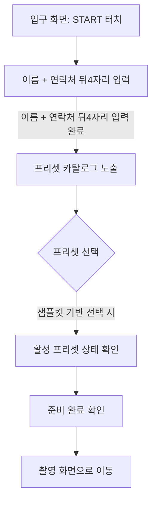
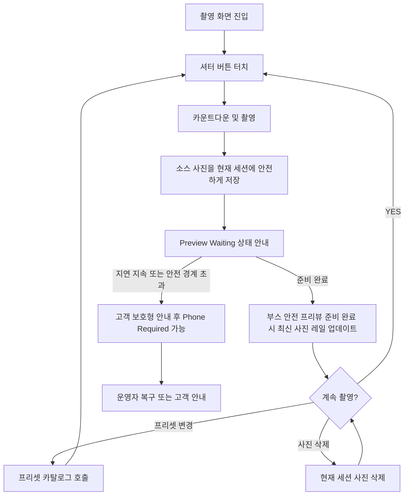
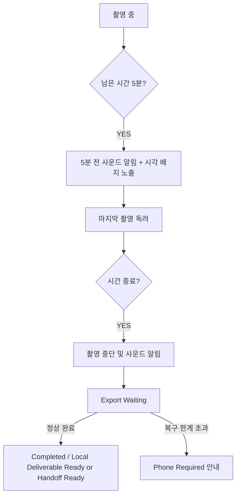

---
stepsCompleted:
  - 1
  - 2
  - 3
  - 4
  - 5
  - 6
  - 7
  - 8
  - 9
  - 10
  - 11
  - 12
  - 13
  - 14
inputDocuments:
  - '_bmad-output/planning-artifacts/prd.md'
  - '_bmad-output/planning-artifacts/architecture.md'
  - 'refactoring/2026-03-15-boothy-darktable-agent-foundation.md'
workflowType: 'ux-design'
lastStep: 14
project_name: 'Boothy'
user_name: 'Noah Lee'
date: '2026-03-11'
---

# UX Design Specification Boothy

**Author:** Noah Lee
**Date:** 2026-03-11

---

## Executive Summary

### Project Vision
Boothy는 복잡한 세부 조정 과정 없이, 전문가가 설계한 프리셋을 통해 누구나 고품질의 사진을 빠르고 즐겁게 촬영할 수 있는 윈도우 기반 포토 부스 솔루션입니다. 사용자의 시간을 존중하며, 명확한 가이드와 감각적인 디자인(Brutal Core)으로 신뢰감 있는 촬영 경험을 제공합니다.

### Target Users
- **현장 고객:** 빠른 촬영 시작과 확실한 결과물을 원하는 일반인.
- **프리셋 운영 관리자:** 승인된 프리셋 카탈로그를 설계, 검수, 게시하는 내부 사용자.
- **시스템 운영자:** 장비 상태를 모니터링하고 필요 시 복구 작업을 수행하는 관리자.

### Key Design Challenges
- **시간 관리의 명확성:** 쿠폰 연동 시간과 종료 예고 사운드 알림을 통한 사용자 안내.
- **선택의 단순화:** 세부 조정 화면 없이 프리셋 카탈로그 중심으로 충분한 선택감을 주는 UX.
- **신뢰성 있는 피드백:** 촬영 성공과 프리뷰 준비 완료를 구분해 안내하고, 현재 세션 범위 안에서 결과 준비 상태를 안전하게 이해시키는 흐름.

### Design Opportunities
- **강렬한 시각적 정체성:** Brutal Core(Retro-Digital) 스타일을 활용한 독보적인 부스 UI.
- **청각적 경험 디자인:** 사운드 알림을 통한 브랜드 아이덴티티 강화 및 사용자 가이드.

## Reading Guide

이 문서는 구현 준비를 돕기 위해 `구속되는 UX 요구사항`과 `설계 가이드 / 지향점`을 구분합니다. 이 문서가 PRD 또는 아키텍처보다 우선하지 않으며, 충돌 시 PRD와 아키텍처의 계약 범위를 따릅니다.

### 구속되는 UX 요구사항
- 고객 경험은 booth-first, preset-driven 흐름을 유지해야 하며 고객에게 세부 조정 화면이나 내부 제작 도구를 노출하지 않습니다.
- 고객 시작 단계는 `이름 + 휴대전화 뒤4자리` 입력만으로 끝나야 하며, 전체 전화번호 입력이나 예약 검증 흐름을 요구하지 않습니다.
- 고객은 현재 활성 프리셋, 최신 촬영 결과, 현재 세션 범위만의 사진을 이해할 수 있어야 합니다.
- 조정된 종료 시각은 세션 시작부터 명확히 보여야 하며, 5분 전 경고와 종료 시점 이후의 다음 행동은 고객 안전 문구로 이해 가능해야 합니다.
- 고객용 문구는 plain-language와 낮은 문구 밀도 원칙을 지키고 기술 진단어 또는 내부 운영 용어를 포함하지 않습니다.
- `Preview Waiting`에서는 "촬영은 저장되었지만 확인용 사진을 준비 중"이라는 사실과 지금 가능한 행동을 함께 보여줘야 합니다.
- `Phone Required`에서는 "안전한 다음 단계가 잠시 멈췄다"는 사실, 연락 방법, 고객이 하지 않아도 되는 일을 분명히 알려야 합니다.
- 운영자/내부 프리셋 관리 화면의 진입점은 고객 기본 흐름에서 숨겨져 있어야 하며, 관리자 비밀번호 인증 전에는 노출되지 않아야 합니다.
- 부스 화면은 고대비, 멀티모달 알림, 터치 친화적 조작을 유지해야 합니다. 넉넉한 터치 영역은 필수이며 `80px`은 설계 시작 기준선일 뿐 별도 하드웨어 검증 없이 자동으로 릴리스 계약이 되지는 않습니다.

### 설계 가이드 / 지향점
- 현재 baseline의 프리셋 선택은 대표 썸네일/샘플컷 중심으로 충분해야 하며, 라이브 프리뷰는 후행 실험 항목이지 계약 요구사항이 아닙니다.
- 매우 빠른 프리셋 전환, 프리뷰와 최종 결과의 높은 유사성, exact progress tracker 표현, 축하 애니메이션, 특정 컴포넌트 배치는 지향점이지 계약 요구사항은 아닙니다.
- 구현상 트레이드오프가 필요하면 booth-first, preset-driven, Brutal Core 방향과 고객 직접 조정 비노출 원칙을 우선 유지합니다.

## 2. Core User Experience

### 2.1 Defining Experience
Boothy의 정의적 경험은 **'프리셋 우선 촬영(Filter-First Capture)'**입니다. 사용자가 촬영 전에 "완성된 룩을 골랐다"는 확신을 얻고 자신감 있게 셔터를 누르는 순간이 Boothy의 핵심 가치입니다. 이 확신은 대표 프리뷰 타일, 샘플컷, 활성 프리셋 표시, 최신 사진 피드백으로 형성되며, 별도의 복잡한 조정 단계 대신 '완성된 룩'을 선택하는 즐거움에 집중합니다.

### 2.2 User Mental Model
사용자는 Boothy를 '나를 가장 예쁘게 보여주는 스마트한 거울'로 인식합니다. 별도의 보정 단계가 나중에 열릴 것이라 기대하기보다, 지금 선택한 프리셋의 성격과 최신 사진 피드백이 이후 결과물에 일관되게 반영될 것이라는 정신 모델을 가집니다. 이 문서는 픽셀 단위의 100% 사전 일치를 계약으로 요구하지는 않지만, 사용자가 속았다고 느끼지 않을 정도의 룩 일관성은 유지해야 한다고 봅니다.

### 2.3 Success Criteria
**구속되는 UX 요구사항**
- **프리셋 중심 흐름:** 사용자는 승인된 프리셋을 고르고 직접 조정 없이 촬영을 이어갈 수 있어야 합니다.
- **신뢰 피드백:** 촬영 성공 후 최신 사진과 활성 프리셋 상태를 현재 세션 범위 안에서 이해할 수 있어야 합니다.
- **타이밍 명확성:** 조정된 종료 시각, 5분 전 경고, 종료 후 다음 행동이 고객 안전 문구로 명확해야 합니다.
- **자율적 흐름:** 별도 설명 없이도 사용자가 스스로 프리셋 변경, 촬영, 현재 세션 검토를 이어갈 수 있어야 합니다.

**설계 지향점**
- **빠른 체감 반응:** 프리셋 선택과 주요 고객 액션은 리듬을 끊지 않도록 빠르게 인지 가능해야 하며, 구체적인 성능 계약은 PRD의 NFR-003을 따릅니다.
- **룩 일관성:** 선택 화면의 프리셋 표현과 최종 결과물은 사용자가 속았다고 느끼지 않을 정도로 충분히 일관되어야 합니다.

### 2.4 Novel UX Patterns
익숙한 '부스 촬영' 패턴 위에 **'Brutal Core 비주얼 기반의 프리셋 카탈로그'**를 결합했습니다. 또한, **'청각적 시간 가이드(5분 전 경고음)'**를 통해 무인터랙션 상황에서도 사용자가 세션의 흐름을 자연스럽게 인지하도록 돕는 새로운 소통 방식을 도입합니다.

### 2.5 Experience Mechanics
1. **진입:** 세션 시작 직후 이름과 휴대전화 뒤4자리를 입력하고, 이어서 직관적인 프리셋 선택 화면으로 이동합니다. 고객은 이 입력이 현재 세션을 구분하기 위한 최소 정보라고 이해할 수 있어야 합니다.
2. **상호작용:** 프리셋 카드 터치 시 선택된 룩이 즉시 인지되어야 합니다. 이는 활성 상태 강조와 대표 프리뷰 타일 또는 샘플컷으로 표현하며, 사용자는 가장 마음에 드는 순간 촬영 버튼을 누릅니다.
3. **피드백:** 촬영 직후에는 먼저 현재 세션에 소스 사진이 안전하게 저장되었음을 기준으로 성공을 안내하고, 프리뷰가 아직 준비 중이면 `Preview Waiting` 상태에서 "사진은 저장되었고 확인용 사진을 준비 중"이라는 메시지를 보여줍니다. 이 상태에서는 고객이 다음 촬영을 이어갈 수 있는지, 잠시 기다리면 되는지, 또는 현재 사진 레일이 아직 비어 있어도 정상인지가 분명해야 합니다. 이후 부스 안전 프리뷰가 준비되면 화면 하단 썸네일 레일에 최신 사진이 나타나며 확신을 줍니다.
4. **마무리:** 쿠폰 연동 시간 종료 5분 전 사운드 알림으로 안내하며, 종료 후에는 `Export Waiting`, `Completed`, 또는 `Phone Required` 중 현재 상태에 맞는 고객 안전 흐름으로 세션을 마무리합니다. 특히 `Phone Required`는 실패 고지가 아니라 "지금은 부스가 다음 단계를 안전하게 끝낼 수 없어 도움이 필요하다"는 안내로 설계되어야 하며, 고객이 임의 조작을 시도하지 않도록 행동을 단순화해야 합니다.

### Platform Strategy
Boothy는 윈도우 데스크톱 기반의 대형 터치스크린 포토 부스 하드웨어에 최적화된 플랫폼 전략을 따릅니다. 서서 조작하는 환경을 고려하여 모든 버튼과 제어 요소는 크고 명확한 Brutal Core 스타일을 적용하며, 로컬 하드웨어와 긴밀하게 연동되어 오프라인에서도 끊김 없는 촬영 성능을 보장합니다.

### Experience Principles
1. **"생각하지 말고 찍으세요"**: 선택지는 단순화하고, 다음 행동은 명확한 시각적 언어로 제안합니다.
2. **"당신의 시간은 소중합니다"**: 쿠폰에 따라 유동적인 세션 시간을 투명하게 공유하고 사운드로 미리 안내합니다.
3. **"결과물로 증명합니다"**: 프리셋의 시각적 퀄리티와 빠른 처리 속도로 신뢰를 구축합니다.
4. **"부스는 살아있습니다"**: 상태 변화를 시각적 애니메이션과 브랜드 고유의 사운드로 생동감 있게 전달합니다.

## Desired Emotional Response

### Primary Emotional Goals
Boothy의 주된 감성 목표는 "자신감 넘치는 즐거움(Confident Delight)"입니다. 사용자는 조작에 대한 두려움 없이 기기를 완전히 통제하고 있다는 자신감을 느끼며, 전문가 수준의 프리셋 결과물을 확인하는 순간 기대 이상의 즐거움을 경험해야 합니다.

### Emotional Journey Mapping
- **진입:** 힙한 디자인(Brutal Core)을 통해 느껴지는 호기심과 촬영에 대한 기대감.
- **프리셋 선택:** "나에게 가장 잘 어울리는 룩"을 고르는 과정에서의 즐거운 고민.
- **촬영 중:** 실시간 상태 피드백을 통한 몰입감과 활력 넘치는 촬영 리듬.
- **프리뷰 대기:** 사진은 잘 찍혔다는 안도감과, 결과가 곧 보일 것이라는 침착한 기대.
- **경고(5분 전):** 당황하지 않고 남은 촬영을 마무리하게 돕는 기분 좋은 긴장감(사운드 안내).
- **완료 및 퇴장:** 만족스러운 결과물이 안전하게 관리되고 있다는 확신과 성취감.
- **도움 요청 필요:** 예상치 못한 중단 상황에서도 "내 사진이 사라진 건 아니다"라고 느끼게 하는 보호감.

### Micro-Emotions
- **확신(Trust):** 카메라 연결 및 세션 상태가 명확히 공유될 때 느껴지는 신뢰.
- **침착(Calm):** 시간이 줄어들거나 대기 상황에서도 따뜻한 가이드로 유지되는 평정심.
- **연결(Connection):** 부스가 단순한 기계가 아니라 나의 촬영을 돕는 파트너라는 느낌.
- **성취(Accomplishment):** 세션 종료 후 "인생샷을 건졌다"는 뿌듯함.
- **보호감(Protection):** 막힌 상태에서도 부스가 사진과 다음 절차를 책임지고 있다는 느낌.

### Design Implications
- **감정: 확신** → 명확한 Brutal Core 스타일의 상태 배지와 굵은 테두리의 버튼 설계.
- **감정: 침착** → 시간에 쫓기는 공포 대신 "여유로운 마무리"를 제안하는 사운드 디자인과 부드러운 문구.
- **감정: 즐거움** → 프리셋 전환 시의 생동감 있는 애니메이션과 촬영 성공 시의 시각적 축하 효과.
- **감정: 보호감** → `Preview Waiting`과 `Phone Required`에서 현재 보장되는 사실, 기다려야 할 이유, 연락 수단을 한 화면 안에 단단한 위계로 배치.

### Emotional Design Principles
1. **"사용자를 비난하지 마세요"**: 어떤 상황에서도 사용자가 잘못한 것처럼 느끼게 하지 않고 친절하게 유도합니다.
2. **"작은 순간에 생명력을"**: 로딩이나 상태 전환 등 사소한 순간에도 시각/청각적 리듬감을 부여하여 지루함을 없앱니다.
3. **"기대 이상의 결과"**: 프리셋 적용 결과가 사용자의 예상을 뛰어넘는 고품질로 나타나게 하여 감동을 줍니다.
4. **"따뜻한 기술"**: Brutal Core의 강렬한 외형 속에 사용자를 세심하게 배려하는 따뜻한 언어와 사운드를 담습니다.

## UX Pattern Analysis & Inspiration

### Inspiring Products Analysis
Boothy의 디자인 영감은 한국형 셀프 사진관 브랜드(Photoism, 인생네컷)의 '단계별 단순함'과 인스타그램/스노우 등 필터 중심 앱의 '즉각적인 룩(Look) 경험', 그리고 Retro-Digital 스타일의 '강렬한 정보 위계'에서 얻습니다. 사용자가 교육 없이도 즉시 촬영에 몰입할 수 있는 직관적인 흐름을 최우선으로 합니다.

### Transferable UX Patterns
- **단계 인지 가이드:** 현재 위치와 남은 촬영 관련 핵심 상태를 사용자가 쉽게 이해하도록 돕습니다. 상단 바, 헤더 배지, 단계 라벨 등 구체적 표현은 구현 재량입니다.
- **프리셋 카드 선택:** 터치 인터페이스에 최적화된 큰 프리셋 썸네일 카드를 사용하여 선택의 재미와 편의성을 높입니다.
- **Brutal Core 시각적 언어:** 굵은 검은색 테두리와 오프셋 그림자를 사용하여 상호작용 가능한 요소를 명확히 구분하고 시각적 임팩트를 줍니다.

### Anti-Patterns to Avoid
- **상세 수치 조절 슬라이더:** 노출, 채도 등 기술적인 조절 도구는 고객에게 혼란을 주므로 배제하고 프리셋으로 대체합니다.
- **작은 타이포그래피와 버튼:** 서서 조작하는 부스 환경을 고려하여 시인성이 낮은 작은 요소들은 절대 사용하지 않습니다.
- **모호한 대기 메시지:** "처리 중"과 같은 무미건조한 표현 대신 "인생샷 현상 중"과 같은 구체적이고 따뜻한 상태 공유를 지향합니다.
- **행동이 없는 장애 상태:** 고객이 무엇을 해도 되는지, 하지 말아야 하는지 모르는 `Phone Required` 화면은 금지합니다.

### Design Inspiration Strategy
- **채택:** 셀프 사진관의 직관적 흐름과 소셜 미디어의 필터 경험을 Brutal Core 디자인 시스템에 녹여냅니다.
- **수정:** Brutal Core의 강렬한 외형을 유지하되, 안내 문구와 사운드는 사용자를 세심하게 배려하는 톤으로 조정합니다.
- **배제:** 전문가용 제작 도구를 과감히 제거하고, 사용자의 창의적 선택을 '프리셋 카탈로그' 내로 한정하여 속도감 있는 경험을 만듭니다.

## Design System Foundation

### 1.1 Design System Choice
Boothy의 현재 UX 구현 기준안은 **Tailwind CSS와 Headless UI를 우선 검토하는 '커스텀 테마 디자인 시스템'**입니다. 이는 Brutal Core(Retro-Digital) 정체성을 일관되게 구현하기 위한 가이드이며, PRD 계약 자체를 구성하는 필수 기술 선택은 아닙니다.

### Rationale for Selection
- **정체성 구현:** Brutal Core의 핵심 요소인 굵은 테두리와 오프셋 그림자를 Tailwind의 설정만으로 효율적으로 관리할 수 있습니다.
- **개발 속도:** 기초적인 UI 컴포넌트 로직을 새로 만들지 않고 활용하여 핵심 기능인 촬영 및 프리셋 엔진 개발에 집중할 수 있습니다.
- **확장성:** 향후 운영자 도구 등 다른 인터페이스가 추가되어도 동일한 디자인 토큰을 사용하여 일관성을 유지하기 쉽습니다.

### Implementation Approach
- **디자인 토큰:** 색상(Warm Beige, Bold Black, Primary Accent), 테두리 두께(4px 이상), 그림자(Hard Offset) 등을 토큰화하여 관리하는 방식을 우선 검토합니다.
- **컴포넌트 기반:** 모든 UI 요소를 재사용 가능한 컴포넌트 단위로 정리하고 Brutal Core의 시각적 규칙을 일관되게 상속하는 방향을 기본 전략으로 봅니다.

### Customization Strategy
- **Brutal Core 스타일 가이드:** 모든 카드와 버튼은 직각(Square)을 기본으로 하며, 굵은 검은색 테두리와 강한 대비를 사용합니다.
- **따뜻한 톤의 조화:** 강렬한 비주얼 속에서도 Warm Beige(따뜻한 베이지) 배경색을 사용하여 사용자에게 정서적 안정감을 제공합니다.

## Visual Design Foundation

### Color System
Boothy는 **'Warm Brutalist'** 팔레트를 사용하여 강렬한 시각적 대비와 정서적 따뜻함을 동시에 제공합니다.
- **Base:** Warm Beige (#F5F5DC) / **Ink:** Bold Black (#000000)
- **Accent:** Clay Orange (#FF4500)
- **Semantic:** Success (Olive Green), Warning (Amber), Error (Brick Red)
- **Style:** 모든 컴포넌트에 4px 이상의 검은색 테두리와 하드 오프셋 그림자 적용.

### Typography System
**Pretendard Variable** 단일 서체를 사용하여 정보의 위계를 명확히 하고 Retro-Digital 스타일의 정갈함을 유지합니다.
- **Headings:** 대담하고 굵은 서체(Bold)를 사용하여 멀리서도 상태를 쉽게 인지할 수 있도록 합니다.
- **Hierarchy:** 크기와 굵기의 극단적 대비를 통해 사용자가 다음에 해야 할 행동을 즉각적으로 파악하게 돕습니다.

### Spacing & Layout Foundation
**8px 그리드 시스템**을 기반으로 하며, '여유로운 집중(Spacious Focus)'을 원칙으로 합니다.
- **Touch Targets:** 서서 조작하는 환경을 고려해 넉넉한 터치 영역이 필요합니다. `80x80px`은 기본 설계 기준선이며, 실제 구현 계약은 승인된 하드웨어 검증 결과로 확정합니다.
- **Sectioning:** 정보를 굵은 테두리의 독립된 카드 모듈로 분리하여 시각적 노이즈를 최소화합니다.

### Accessibility Considerations
- **Contrast:** 배경과 요소 간의 고대비(High Contrast)를 엄격히 준수합니다.
- **Multimodal Feedback:** 시간 종료 경고 등 주요 상태 변화는 시각 배지와 브랜드 사운드를 병행하여 전달합니다.

## Design Direction Decision

### Design Directions Explored
'Poster Punch(강렬한 포스터)', 'Analog Blueprint(아날로그 설계도)', 'Sticker Play(스티커 스타일)', 'Minimal Monolith(미니멀 스타일)' 등 Brutal Core 기반의 다양한 시각적 변주를 탐색하였습니다. 특히 굵은 테두리와 따뜻한 배경색의 조합이 터치 중심 환경에서 어떻게 작동하는지 중점적으로 검토하였습니다.

### Chosen Direction
최종적으로 **'Brutal Core (Original Squared)'** 방향을 확정하였습니다. 이는 Retro-Digital의 정수를 따르며, 모든 컴포넌트에 직각(Square) 프레임과 4px 이상의 굵은 검은색 테두리, 하드 오프셋 그림자를 적용한 스타일입니다.

### Design Rationale
이 방향은 Boothy가 지향하는 '신뢰감 있는 전문가의 룩'과 '친근한 부스 경험' 사이의 균형을 가장 완벽하게 잡아줍니다. 날카로운 직각 프레임은 시스템의 견고함과 정밀함을 상징하며, Warm Beige 배경색은 사용자에게 편안함을 줍니다. 또한, 정보 위계가 매우 명확하여 서서 조작하는 환경에서 인지 부하를 최소화합니다.

### Implementation Approach
Tailwind CSS의 유틸리티 클래스를 확장하여 `border-4`, `shadow-brutal` 등의 커스텀 클래스를 정의하고, 이를 모든 UI 프리미티브에 적용합니다. `ux-design-directions.html`에 구현된 컴포넌트 스타일을 기반으로 실제 React 컴포넌트 라이브러리를 구축합니다.

## User Journey Flows

### 세션 시작 및 프리셋 선택 (Entry & Setup)
사용자가 부스에 들어와 이름과 휴대전화 뒤4자리를 입력하고 프리셋을 선택하여 촬영 준비를 마치는 과정입니다.

### 촬영 루프 및 실시간 확인 (Capture Loop)
선택한 프리셋으로 사진을 촬영하고, 현재 세션에 저장된 캡처와 이후 준비되는 프리뷰를 구분해 이해하며 만족감을 얻는 핵심 반복 과정입니다.

### 시간 종료 예고 및 완료 (Timed Completion)
남은 시간을 인지하며 촬영을 마무리하고 내보내기를 기다리는 퇴장 과정입니다.

### Preview Waiting 보호 흐름
`Preview Waiting`은 단순 로딩 화면이 아니라, 고객 신뢰를 지키는 보호 상태입니다. 이 구간에서는 "방금 촬영은 저장되었다"는 사실이 가장 먼저 보여야 하고, 프리뷰가 늦어지는 동안에도 고객이 패닉에 빠지지 않게 만들어야 합니다.

- 상단 상태 라벨은 `Preview Waiting` 또는 고객 친화적 로컬라이즈드 문구로 고정하되, 기술 용어보다 "사진 확인 준비 중" 같은 해석형 문구를 우선합니다.
- 본문 첫 문장은 저장 완료 사실을 먼저 말하고, 둘째 문장에서 확인용 사진이 준비 중임을 설명합니다.
- 가능하면 현재 액션 가능 여부를 함께 제시합니다. 예: "잠시 뒤 확인 사진이 나타납니다" 또는 "다음 촬영은 계속 가능합니다".
- 최신 사진 레일이 아직 비어 있어도 정상이라는 점을 보조 문구로 명시합니다.
- 이 상태가 길어져 `Phone Required`로 넘어갈 수 있는 경우에도, 고객에게는 내부 실패 원인이 아니라 "도움이 필요하다"는 결과만 전달합니다.

### Phone Required 보호 흐름
`Phone Required`는 에러 덤프가 아니라, 고객을 안전하게 다음 단계로 이동시키는 서비스 상태입니다. 이 화면은 고객의 책임을 줄이고, 사진 손실 공포를 낮추고, 연락 행동 하나만 분명히 남겨야 합니다.

- 헤드라인은 비난형 문구 대신 "도움이 필요해요"처럼 부드럽지만 분명한 문구를 사용합니다.
- 첫 문장에서는 현재 세션이 안전하게 보존되고 있는지 여부를 고객이 이해할 수 있게 설명합니다.
- 둘째 문장에서는 연락 대상과 방법을 하나만 강하게 보여줍니다. 전화번호, 호출 버튼, 안내 데스크 위치 중 운영 정책상 승인된 한 가지가 핵심 액션입니다.
- 고객이 해서는 안 되는 행동은 짧게 차단합니다. 예: 장비 전원 재시작 시도, 반복 촬영 시도, 타 세션 진입.
- 운영자 개입 후 원상 복귀될 가능성이 있다면 "잠시만 기다려 주세요"와 "도움을 요청해 주세요"의 우선순위를 명확히 분리합니다.
- 시각적으로는 경고 색을 쓰더라도 공포감을 키우는 깜빡임보다, 안정적인 고대비 카드와 큰 연락 액션을 우선합니다.

### Journey Patterns
- **빠른 피드백:** 프리셋 선택, 세션 진입, 삭제 확인, 촬영 성공 등 주요 액션은 사용자가 반응을 인지할 수 있을 만큼 빠르게 확인되어야 하며, 구체적인 성능 예산은 PRD의 NFR-003을 따릅니다.
- **상시 상태 공유:** 현재 부스 별칭과 타이밍 정보, 촬영 관련 핵심 상태는 화면 안에서 쉽게 인지 가능해야 합니다. 이를 상단 배지, 헤더, 고정 영역 등 어떤 패턴으로 표현할지는 구현에서 조정할 수 있습니다.
- **비파괴적 가이드:** 경고 알림이 사용자의 촬영 흐름을 막지 않고, 보조적인 정보로 제공되도록 설계합니다.
- **상태 진실성:** 촬영 저장, 프리뷰 준비, 세션 종료 후 결과 준비는 각각 다른 상태로 다뤄야 하며 하나의 성공 메시지로 뭉개지지 않아야 합니다.
- **단일 행동 원칙:** `Preview Waiting`과 `Phone Required`처럼 사용자가 잠시 멈춰야 하는 상태에서는 핵심 행동을 하나만 강조합니다.

### Flow Optimization Principles
- **단계 최소화:** 세션 시작부터 첫 촬영까지의 단계를 3단계 이내로 줄여 즉각적인 가치를 전달합니다.
- **오류 복구:** 카메라 연결 지연 시 안심할 수 있는 상태 안내 메시지를 제공하여 불안감을 제거합니다.
- **성취감 부여:** 세션 종료 시 촬영된 사진들을 회고할 수 있는 시각적 연출을 통해 만족감을 극대화합니다.

## Component Strategy

### Design System Components
Boothy는 Tailwind CSS를 기반으로 한 Brutal Core 테마를 사용하여 버튼, 입력창, 모달 등 기본 UI 요소의 일관성을 확보합니다. 모든 기본 컴포넌트는 굵은 검은색 테두리와 하드 오프셋 그림자를 기본 스타일로 가집니다.

### Custom Components

#### ### 프리셋 카탈로그 카드 (Preset Card)
- **목적:** 직관적인 룩 선택 유도.
- **구조:** 예시 이미지 + 룩 이름 + 선택 강조 테두리.
- **인터랙션:** 터치 즉시 선택 상태를 분명히 보여주고, 가능한 범위에서 대표 프리뷰 표현을 갱신합니다.

#### ### 사운드 기반 시간 알림 배지 (Timed Alert Badge)
- **목적:** 쿠폰 연동 세션 시간 관리 및 안내.
- **구조:** 디지털 타이머 + 상태별 배경색 변화(Amber/Red).
- **인터랙션:** 종료 5분 전 사운드 알림 재생 및 시각적 강조.

#### ### 최신 사진 레일 (Latest Photo Rail)
- **목적:** 촬영 성공 피드백 및 세션 내 사진 확인.
- **구조:** 가로 스크롤형 썸네일 리스트 + 삭제 버튼.

#### ### 프리뷰 대기 패널 (Preview Waiting Panel)
- **목적:** 촬영 저장 사실과 프리뷰 준비 상태를 분리해 고객 신뢰 유지.
- **구조:** 저장 완료 배지 + 대기 메시지 + 선택적 보조 문구 + 현재 가능한 다음 행동.
- **인터랙션:** 프리뷰 준비 완료 시 자연스럽게 최신 사진 레일 또는 리뷰 상태로 전환합니다.

#### ### 도움 요청 카드 (Phone Required Support Card)
- **목적:** 안전한 다음 행동을 전화 또는 현장 안내 하나로 압축.
- **구조:** 헤드라인 + 현재 보호 상태 설명 + 단일 연락 액션 + 짧은 금지 행동 안내.
- **인터랙션:** 운영 정책에 맞춰 전화, 호출, 데스크 이동 중 한 가지 액션만 최우선 버튼으로 노출합니다.

### Component Implementation Strategy
- **Brutal Core 상속:** 모든 컴포넌트는 사전에 정의된 디자인 토큰(테두리 4px, 오프셋 그림자 8px)을 엄격히 따릅니다.
- **터치 우선 설계:** 서서 조작하는 환경에 맞춰 모든 인터랙션 요소는 넉넉한 터치 영역을 유지해야 하며, `80px`은 초기 설계 기준선으로 취급합니다.

### Implementation Roadmap
- **Phase 1:** 촬영 루프 필수 요소 (카메라 패널, 셔터, 프리셋 카드)
- **Phase 2:** 세션 관리 요소 (시간 배지, 입력 필드, 삭제 모달, Preview Waiting 패널)
- **Phase 3:** 경험 완성 요소 (사진 레일, 축하 애니메이션, Phone Required 도움 카드)

## UX Consistency Patterns

### Button Hierarchy
Boothy의 모든 버튼은 Brutal Core 스타일(직각, 굵은 테두리, 그림자)을 따르며, 중요도에 따라 색상으로 구분합니다.
- **Primary:** Clay Orange (#FF4500) - 핵심 동작 (촬영, 시작)
- **Secondary:** White / Transparent - 보조 동작 (프리셋 변경, 취소)
- **Destructive:** Fire Brick Red (#B22222) - 돌이킬 수 없는 동작 (삭제, 종료)

### Feedback Patterns
상태 변화를 시각적 배지와 사운드로 즉각 전달합니다.
- **Success:** Olive Green 배지 - 긍정적 결과 피드백.
- **Warning:** Amber 배지 - 시간 종료 5분 전 등 주의가 필요한 상황 (사운드 병행).
- **Error:** Brick Red 배지 - 즉각적인 조치나 대기가 필요한 문제 상황.
- **Preview Waiting:** 저장 완료 사실을 함께 보여주는 중립/안심 계열 배지와 대기 메시지 조합.
- **Phone Required:** 강한 대비의 도움 요청 카드와 단일 연락 액션 조합. 원인 설명보다 다음 행동을 우선합니다.

### Form Patterns
이름과 연락처 뒤4자리 입력 등 핵심 입력 폼은 부스 환경에서 오조작을 줄일 만큼 충분한 터치 영역을 확보해야 합니다. `80px`은 검증 전 초기 기준선입니다.
- **Validation:** 입력 즉시 유효성을 검사하여 하단에 명확한 텍스트로 가이드합니다.

### Navigation Patterns
- **Session Header:** 부스 별칭과 시간 정보(조정된 종료 시각 또는 이에 준하는 명확한 타이밍 정보)는 화면 안에서 쉽게 인지 가능해야 합니다. 고정 위치와 시각 표현은 구현에서 조정 가능합니다.
- **Progress Tracker:** 현재 세션의 진행 단계(입력-선택-촬영-완료)를 보여주는 패턴은 선택 사항입니다. 필요 시 사용할 수 있지만, 정확한 단계 수나 시각 표현은 구현 릴리스 게이트가 아닙니다.

### Additional Patterns
- **Empty State:** 데이터가 없을 때 사용자의 다음 행동을 유도하는 일러스트와 문구를 제공합니다.
- **Loading State:** "인생샷 현상 중..." 등 부스 컨셉에 어울리는 메시지와 함께 진행 상태를 공유합니다.
- **Escalation State:** `Phone Required`는 일반 로딩과 다른 화면 위계를 사용하며, 고객이 재시도보다 도움 요청을 먼저 이해하도록 설계합니다.

## Responsive Design & Accessibility

### Responsive Strategy
Boothy는 대형 터치스크린 환경에 최적화된 **'Booth-First'** 전략을 따릅니다. 사용자의 팔 궤적과 시선을 고려하여 핵심 상호작용 요소를 배치하며, 화면 크기에 따라 제어 패널의 밀도를 유연하게 조정합니다.

### Breakpoint Strategy
- **Booth Main:** 1024px+ (풀스크린 촬영 경험)
- **Operator View:** 768px - 1023px (상태 모니터링 및 설정)
- **No customer mobile surface in MVP:** 반응형 검토 범위는 승인된 부스 화면과 운영자용 데스크톱급 화면으로 제한합니다.

### Accessibility Strategy
WCAG 2.2 AA 수준을 기본 접근성 목표로 하여 누구나 소외 없는 촬영 경험을 제공합니다.
- **High Contrast:** 따뜻한 베이지와 블랙의 고대비 조합 유지.
- **Giant Touch Targets:** 모든 핵심 버튼은 부스 환경에 맞는 넉넉한 터치 영역을 유지해야 합니다. `80px`은 하드웨어 검증 전 초기 기준선입니다.
- **Multimodal Alerts:** 중요 알림(시간 종료 등)은 시각 배지와 사운드 알림 병행.

### Testing Strategy
- 실제 부스 하드웨어에서의 터치 반응성 및 Standing 사용성 테스트.
- 색약 및 시각 약자를 위한 고대비 시뮬레이션 테스트.
- 초보 사용자의 무가이드 촬영 성공률 테스트.

### Implementation Guidelines
- **Relative Units:** 모든 간격과 크기에 `rem` 단위를 사용하여 시스템 폰트 크기 변경에 유연하게 대응합니다.
- **Semantic HTML:** 스크린 리더 호환성을 위해 의미 있는 태그(`button`, `nav`, `section`)를 사용합니다.
- **Focus Management:** 모달 팝업 시 포커스 가두기 및 ESC 키를 통한 닫기 기능을 지원합니다.
